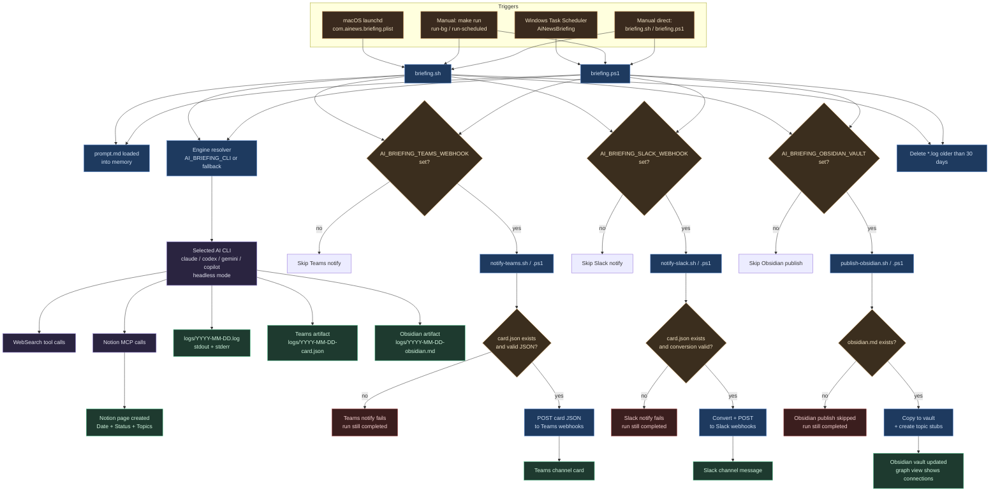
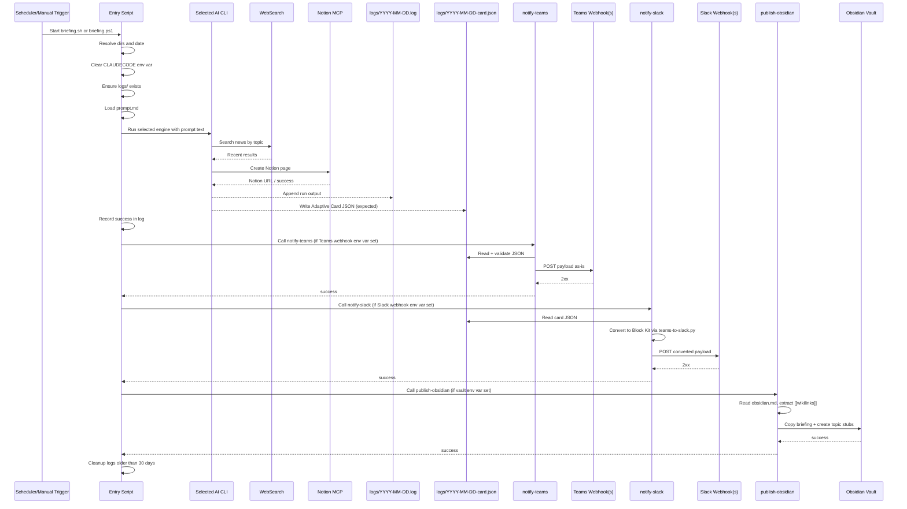
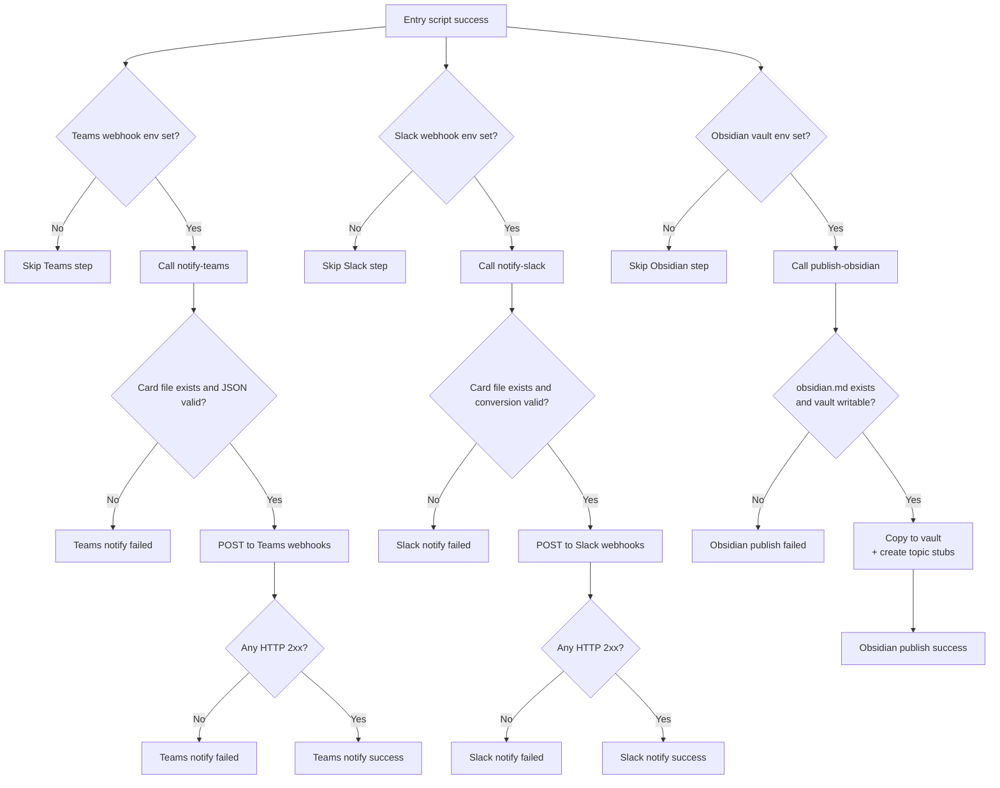
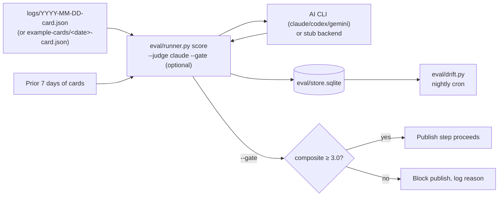
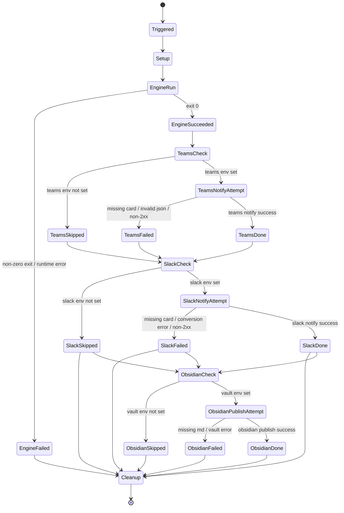

# End-to-End Flow: AI News Briefing Pipeline

This document describes the real runtime flow of this repository as of April 15, 2026.
It is based on the current implementation in:

- `briefing.sh`
- `briefing.ps1`
- `prompt.md`
- `scripts/notify-teams.sh`
- `scripts/notify-teams.ps1`
- `scripts/notify-slack.sh`
- `scripts/notify-slack.ps1`
- `scripts/publish-obsidian.sh`
- `scripts/publish-obsidian.ps1`
- `scripts/teams-to-slack.py`
- `scripts/build-teams-card.py` (legacy reference)
- `Makefile`

---

## 1. System Topology

```mermaid
flowchart TD
    classDef trig fill:#3a2a1e,stroke:#d49b5b,color:#f5e6c8
    classDef ep   fill:#1e3a5f,stroke:#5b8dd8,color:#d4e4f8
    classDef ai   fill:#2a2440,stroke:#8b7ad4,color:#e4e4ef
    classDef art  fill:#1e3a2f,stroke:#5bd49b,color:#d4f8e2
    classDef dec  fill:#3b2e1e,stroke:#d4a35b,color:#f5e6c8
    classDef fail fill:#3b1e1e,stroke:#a13a3a,color:#f8d4d4

    subgraph TRIGGERS["Triggers"]
        A1["macOS launchd<br/>com.ainews.briefing.plist"]:::trig
        A2["Windows Task Scheduler<br/>AiNewsBriefing"]:::trig
        A3["Manual: make run<br/>run-bg / run-scheduled"]:::trig
        A4["Manual direct:<br/>briefing.sh / briefing.ps1"]:::trig
    end

    A1 --> B1["briefing.sh"]:::ep
    A2 --> B2["briefing.ps1"]:::ep
    A3 --> B1
    A3 --> B2
    A4 --> B1
    A4 --> B2

    B1 --> C["prompt.md loaded<br/>into memory"]:::ep
    B2 --> C
    B1 --> ER["Engine resolver<br/>AI_BRIEFING_CLI or fallback"]:::ep
    B2 --> ER
    ER --> D["Selected AI CLI<br/>claude / codex / gemini / copilot<br/>headless mode"]:::ai

    D --> E["WebSearch tool calls"]:::ai
    D --> F["Notion MCP calls"]:::ai
    F --> G["Notion page created<br/>Date + Status + Topics"]:::art

    D --> H["logs/YYYY-MM-DD.log<br/>stdout + stderr"]:::art
    D --> I["Teams artifact<br/>logs/YYYY-MM-DD-card.json"]:::art
    D --> I2["Obsidian artifact<br/>logs/YYYY-MM-DD-obsidian.md"]:::art

    B1 --> J{"AI_BRIEFING_TEAMS_WEBHOOK<br/>set?"}:::dec
    B2 --> J
    J -- no  --> K["Skip Teams notify"]
    J -- yes --> L["notify-teams.sh / .ps1"]:::ep
    L --> M{"card.json exists<br/>and valid JSON?"}:::dec
    M -- no  --> N["Teams notify fails<br/>run still completed"]:::fail
    M -- yes --> O["POST card JSON<br/>to Teams webhooks"]:::ep
    O --> P["Teams channel card"]:::art

    B1 --> R{"AI_BRIEFING_SLACK_WEBHOOK<br/>set?"}:::dec
    B2 --> R
    R -- no  --> S["Skip Slack notify"]
    R -- yes --> T["notify-slack.sh / .ps1"]:::ep
    T --> U{"card.json exists<br/>and conversion valid?"}:::dec
    U -- no  --> V["Slack notify fails<br/>run still completed"]:::fail
    U -- yes --> W["Convert + POST<br/>to Slack webhooks"]:::ep
    W --> X["Slack channel message"]:::art

    B1 --> OC{"AI_BRIEFING_OBSIDIAN_VAULT<br/>set?"}:::dec
    B2 --> OC
    OC -- no  --> OD["Skip Obsidian publish"]
    OC -- yes --> OE["publish-obsidian.sh / .ps1"]:::ep
    OE --> OF{"obsidian.md exists?"}:::dec
    OF -- no  --> OG["Obsidian publish skipped<br/>run still completed"]:::fail
    OF -- yes --> OH["Copy to vault<br/>+ create topic stubs"]:::ep
    OH --> OI["Obsidian vault updated<br/>graph view shows connections"]:::art

    B1 --> Q["Delete *.log older than 30 days"]:::ep
    B2 --> Q
```

---

## 2. Runtime Sequence (Successful Path)

```mermaid
sequenceDiagram
    participant S as Scheduler/Manual Trigger
    participant E as Entry Script
    participant C as Selected AI CLI
    participant W as WebSearch
    participant N as Notion MCP
    participant L as logs/YYYY-MM-DD.log
    participant CF as logs/YYYY-MM-DD-card.json
    participant T as notify-teams
    participant TW as Teams Webhook(s)
    participant S2 as notify-slack
    participant SW as Slack Webhook(s)
    participant OB as publish-obsidian
    participant OV as Obsidian Vault

    S->>E: Start briefing.sh or briefing.ps1
    E->>E: Resolve dirs and date
    E->>E: Clear CLAUDECODE env var
    E->>E: Ensure logs/ exists
    E->>E: Load prompt.md

    E->>C: Run selected engine with prompt text
    C->>W: Search news by topic
    W-->>C: Recent results
    C->>N: Create Notion page
    N-->>C: Notion URL / success

    C-->>L: Append run output
    C-->>CF: Write Adaptive Card JSON (expected)
    E->>E: Record success in log

    E->>T: Call notify-teams (if Teams webhook env var set)
    T->>CF: Read + validate JSON
    T->>TW: POST payload as-is
    TW-->>T: 2xx
    T-->>E: success

    E->>S2: Call notify-slack (if Slack webhook env var set)
    S2->>CF: Read card JSON
    S2->>S2: Convert to Block Kit via teams-to-slack.py
    S2->>SW: POST converted payload
    SW-->>S2: 2xx
    S2-->>E: success

    E->>OB: Call publish-obsidian (if vault env var set)
    OB->>OB: Read obsidian.md, extract [[wikilinks]]
    OB->>OV: Copy briefing + create topic stubs
    OV-->>OB: success
    OB-->>E: success

    E->>E: Cleanup logs older than 30 days
```

---

## 3. Stage-by-Stage Contracts

### Stage A: Trigger and Entry

| Area | macOS path | Windows path |
|---|---|---|
| Scheduler | `com.ainews.briefing.plist` | Task `AiNewsBriefing` via `install-task.ps1` |
| Entry script | `briefing.sh` | `briefing.ps1` |
| Default schedule | 08:00 daily | 08:00 daily |
| Sleep/wake catch-up | `StartInterval` (30 min) runs `briefing.sh --catchup` -- covers a run missed by sleeping through 8 AM on the next wake the same day; never back-fills | `StartWhenAvailable` runs the task on next wake/login |
| Manual trigger | `make run`, `make run-bg`, `make run-scheduled` | same Make targets, or `schtasks /run /tn AiNewsBriefing` |

Entry scripts do the same core setup:

1. Compute `DATE`, `LOG_DIR`, `LOG_FILE`.
2. Clear `CLAUDECODE` to avoid nested-session failures.
3. Create `logs/` if missing.
4. Read `prompt.md` as one string.
5. Resolve engine (`AI_BRIEFING_CLI` or fallback chain) and invoke selected CLI in headless mode.
6. Append output to `logs/YYYY-MM-DD.log`.
7. Attempt Teams notify when Teams webhook env var is present.
8. Attempt Slack notify when Slack webhook env var is present.
9. Attempt Obsidian publish when vault env var is present.
10. Delete only old `*.log` files (>30 days).

Daily engine invocation templates:

- Claude: `claude -p --model <model> --dangerously-skip-permissions "<prompt>"`
- Codex: `codex exec --full-auto "<prompt>"`
- Gemini: `gemini -p "<prompt>"`
- Copilot: `copilot --prompt "<prompt>" --allow-all-tools --allow-all-paths --allow-all-urls`

### Stage B: Date Override / Backfill Path

Both entry scripts support backfill:

- Bash: `briefing.sh YYYY-MM-DD`
- PowerShell: `briefing.ps1 -BriefingDate YYYY-MM-DD`
- Make wrapper: `make run D=YYYY-MM-DD`

When date override is used, scripts prepend a runtime instruction block to the prompt:

- Search relative to override date, not current day.
- Use override date in Notion title.
- Use override date in card filename (`logs/<date>-card.json`).

### Stage C: AI Execution Logic

`prompt.md` defines the internal flow:

1. Step 0a: load `logs/covered-stories.txt` for deduplication.
2. Step 0b: search Notion for existing "AI Daily Briefing" pages. If today's page exists, record its page ID (`PAGE_EXISTS = true`). Read the most recent page for additional dedup context.
3. Step 1: search 9 topic areas for past-24-hour updates. Check official changelogs.
4. Step 2: compile TL;DR + full briefing sections with dates.
5. Step 3: if `PAGE_EXISTS = true`, update the existing Notion page. Otherwise, create a new page. This prevents duplicate pages on re-runs.
6. Step 4: write Adaptive Card JSON to `logs/YYYY-MM-DD-card.json`.
7. Step 5: write Obsidian-formatted markdown with `[[wikilinks]]` to `logs/YYYY-MM-DD-obsidian.md`.
8. Step 6: append today's headlines to `logs/covered-stories.txt`.

### Stage D: Teams, Slack & Obsidian Delivery

**Teams** notifier scripts are intentionally thin:

- Find card file (default `logs/<today>-card.json`, or passed `--card-file` / `-CardFile`).
- Validate JSON (`python3 -m json.tool` on shell, `ConvertFrom-Json` on PowerShell).
- Resolve target URLs from `AI_BRIEFING_TEAMS_WEBHOOK` (semicolon-separated). By default only the first URL is used; pass `--all` / `-All` to post to all.
- POST payload directly to webhooks.

**Slack** notifier scripts follow the same pattern but add a conversion step:

- Read the Teams card JSON file.
- Convert to Slack Block Kit format using `scripts/teams-to-slack.py` (pure Python stdlib, no external deps).
- Resolve target URLs from `AI_BRIEFING_SLACK_WEBHOOK` (same semicolon / `--all` pattern).
- POST converted payload to webhooks.

Neither builds cards from logs. Both are resilient to individual webhook failures.

**Obsidian** publisher scripts are local-only (no network calls):

- Find Obsidian markdown file (default `logs/<today>-obsidian.md`, or passed as argument).
- Validate vault directory exists and is writable.
- Copy markdown to `AI-News-Briefings/` subdirectory in the vault, stripping the `-obsidian` suffix.
- Extract all `[[wikilinks]]` from the markdown and create topic stub pages in `Topics/` for any new topics.
- Topic stubs include YAML frontmatter (`type: topic`, `created: date`) and serve as graph hub nodes.

---

## 4. Notification & Publishing Decision Graph (Teams + Slack + Obsidian)

```mermaid
flowchart TD
    A[Entry script success] --> B{Teams webhook env set?}
    A --> C{Slack webhook env set?}
    A --> OA{Obsidian vault env set?}

    B -->|No| D[Skip Teams step]
    B -->|Yes| E[Call notify-teams]
    E --> F{Card file exists and JSON valid?}
    F -->|No| G[Teams notify failed]
    F -->|Yes| H[POST to Teams webhooks]
    H --> I{Any HTTP 2xx?}
    I -->|No| J[Teams notify failed]
    I -->|Yes| K[Teams notify success]

    C -->|No| L[Skip Slack step]
    C -->|Yes| M[Call notify-slack]
    M --> N{Card file exists and conversion valid?}
    N -->|No| O[Slack notify failed]
    N -->|Yes| P[POST to Slack webhooks]
    P --> Q{Any HTTP 2xx?}
    Q -->|No| R[Slack notify failed]
    Q -->|Yes| S[Slack notify success]

    OA -->|No| OB[Skip Obsidian step]
    OA -->|Yes| OC[Call publish-obsidian]
    OC --> OD{"obsidian.md exists<br/>and vault writable?"}
    OD -->|No| OE[Obsidian publish failed]
    OD -->|Yes| OF["Copy to vault<br/>+ create topic stubs"]
    OF --> OG[Obsidian publish success]
```

---

## 5. Alignment Status

The prompt and runtime pipeline are aligned on a shared card artifact and dual-channel notify paths:

| Component | Behavior |
|---|---|
| `prompt.md` Step 4 | AI writes `logs/YYYY-MM-DD-card.json` directly |
| `scripts/notify-teams.sh/.ps1` | Validates and POSTs the prebuilt card JSON |
| `scripts/notify-slack.sh/.ps1` | Converts prebuilt card JSON to Block Kit and POSTs it |
| `scripts/publish-obsidian.sh/.ps1` | Copies Obsidian markdown to vault, creates topic stub pages |
| `scripts/teams-to-slack.py` | Conversion layer from Teams Adaptive Card schema to Slack Block Kit |
| `scripts/build-teams-card.py` | Legacy parser, not called by any active script |

Additionally, `prompt.md` Step 3 now prevents duplicate Notion pages by checking for an existing page during Step 0b and updating rather than creating when one is found.
Current `briefing.sh` and `briefing.ps1` invoke both notifiers in all-URL mode (`--all` / `-All`) when the corresponding env vars are set.

### Stage E: Quality Eval (post-publish)

After the card is written, the eval harness in `eval/` judges the briefing on a 5-axis rubric and persists the score:

```mermaid
flowchart LR
    CARD["logs/YYYY-MM-DD-card.json<br/>(or example-cards/&lt;date&gt;-card.json)"]
    PRIOR["Prior 7 days of cards"]
    RUN["eval/runner.py score<br/>--judge claude --gate (optional)"]
    JUDGE["AI CLI (claude/codex/gemini)<br/>or stub backend"]
    DB[("eval/store.sqlite")]
    DRIFT["eval/drift.py<br/>nightly cron"]
    GATE{"composite ≥ 3.0?"}
    PUB["Publish step proceeds"]
    BLOCK["Block publish, log reason"]

    CARD --> RUN
    PRIOR --> RUN
    RUN --> JUDGE --> RUN --> DB
    DB --> DRIFT
    RUN -- "--gate" --> GATE
    GATE -- yes --> PUB
    GATE -- no --> BLOCK
```

Behavior contract:

- **No `--gate` flag (default):** the harness is observational. It writes a row to `eval_runs` and exits 0. Existing pipelines are unchanged.
- **With `--gate --gate-threshold 3.0`:** the harness exits 2 when composite is below threshold, allowing the caller (e.g. `briefing.sh`) to abort the Notion/Teams/Slack publish step.
- **Idempotent:** re-running the same `(card_date, prompt_version, judge_model)` overwrites the row. Bumping the prompt version or switching judge model appends rather than overwrites.

---

## 6. Failure-State Diagram

```mermaid
stateDiagram-v2
    [*] --> Triggered
    Triggered --> Setup
    Setup --> EngineRun

    EngineRun --> EngineFailed: non-zero exit / runtime error
    EngineRun --> EngineSucceeded: exit 0

    EngineSucceeded --> TeamsCheck
    TeamsCheck --> TeamsSkipped: teams env not set
    TeamsCheck --> TeamsNotifyAttempt: teams env set
    TeamsNotifyAttempt --> TeamsFailed: missing card / invalid json / non-2xx
    TeamsNotifyAttempt --> TeamsDone: teams notify success

    TeamsSkipped --> SlackCheck
    TeamsFailed --> SlackCheck
    TeamsDone --> SlackCheck

    SlackCheck --> SlackSkipped: slack env not set
    SlackCheck --> SlackNotifyAttempt: slack env set
    SlackNotifyAttempt --> SlackFailed: missing card / conversion error / non-2xx
    SlackNotifyAttempt --> SlackDone: slack notify success

    EngineFailed --> Cleanup
    SlackSkipped --> Cleanup
    SlackFailed --> Cleanup
    SlackDone --> Cleanup

    SlackSkipped --> ObsidianCheck
    SlackFailed --> ObsidianCheck
    SlackDone --> ObsidianCheck

    ObsidianCheck --> ObsidianSkipped: vault env not set
    ObsidianCheck --> ObsidianPublishAttempt: vault env set
    ObsidianPublishAttempt --> ObsidianFailed: missing md / vault error
    ObsidianPublishAttempt --> ObsidianDone: obsidian publish success

    ObsidianSkipped --> Cleanup
    ObsidianFailed --> Cleanup
    ObsidianDone --> Cleanup

    Cleanup --> [*]
```

Notes:

- Teams, Slack, and Obsidian failures do not currently mark the whole run as failed at the script level.
- Log cleanup only targets `*.log`; old `*-card.json` and `*-obsidian.md` files are not rotated by current scripts.

---

## 7. Artifacts and Ownership

| Artifact | Producer | Consumer | Required for success |
|---|---|---|---|
| `logs/YYYY-MM-DD.log` | entry scripts + selected engine stdout/stderr | humans, diagnostic scripts | No (diagnostic) |
| Notion page | selected engine via Notion MCP | Notion workspace | Yes |
| `logs/YYYY-MM-DD-card.json` | selected engine (expected) | notify-teams scripts, notify-slack scripts, teams-to-slack.py | Yes for Teams and Slack paths |
| `logs/YYYY-MM-DD-obsidian.md` | selected engine (expected) | publish-obsidian scripts | Yes for Obsidian path |
| Converted Slack payload (temp) | notify-slack scripts | Slack webhook endpoint | Yes for Slack path |
| Teams message | notify-teams scripts | Teams channel | Optional |
| Slack message | notify-slack scripts | Slack channel | Optional |

---

## 8. Operational Checklist

1. Ensure at least one supported CLI path exists (`claude`, `codex`, `gemini`, or `copilot`).
2. Ensure Notion MCP is configured and has DB access.
3. Ensure `prompt.md` Step 4 still writes `logs/YYYY-MM-DD-card.json`.
4. Ensure `prompt.md` Step 5 still writes `logs/YYYY-MM-DD-obsidian.md`.
5. If Teams is enabled, verify `AI_BRIEFING_TEAMS_WEBHOOK` and direct `notify-teams` test.
6. If Slack is enabled, verify `AI_BRIEFING_SLACK_WEBHOOK`, Python availability, and direct `notify-slack` test.
7. If Obsidian is enabled, verify `AI_BRIEFING_OBSIDIAN_VAULT` points to a valid vault and run `bash scripts/test-obsidian.sh`.
8. Use `make tail` / `make log` to inspect run outcomes.

---

## 9. Recent Changes

- **Duplicate Notion page prevention:** Step 0b now captures `PAGE_EXISTS` and the page ID. Step 3 updates the existing page when one is found, and only creates a new page otherwise. The agent no longer re-queries Notion in Step 3.
- **Multiple webhook support:** Both `AI_BRIEFING_TEAMS_WEBHOOK` and `AI_BRIEFING_SLACK_WEBHOOK` accept semicolon-separated URLs. By default only the first URL is used. Pass `--all` (bash) or `-All` (PowerShell) to post to all configured URLs.
- **Slack integration:** `notify-slack.sh/.ps1` converts the Teams card JSON to Slack Block Kit format using `teams-to-slack.py` and POSTs it to Slack webhooks. No separate card generation needed — reuses the Teams card.
- **Obsidian integration:** `publish-obsidian.sh/.ps1` copies graph-ready markdown (with `[[wikilinks]]` and YAML frontmatter) to an Obsidian vault. Topic stub pages are auto-created for graph connectivity. Set `AI_BRIEFING_OBSIDIAN_VAULT` to enable.
- **Prompt/runtime alignment:** `prompt.md` Step 4 now writes `logs/YYYY-MM-DD-card.json` directly. Step 5 writes `logs/YYYY-MM-DD-obsidian.md`. The legacy `build-teams-card.py` parser is no longer part of the active pipeline.
- **Headless engine updates:** Codex now runs via `codex exec --full-auto`, and Copilot runs via `copilot --prompt ... --allow-all-tools --allow-all-paths --allow-all-urls` for non-interactive execution.
