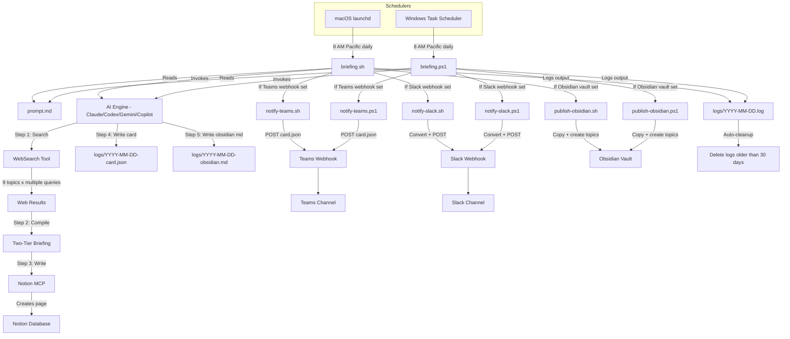
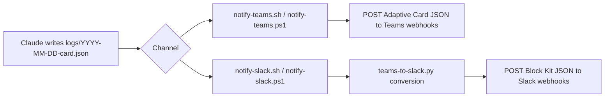
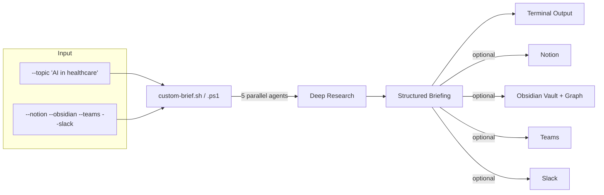

# AI News Briefing


Automated daily AI news research agent that searches the web, compiles a structured briefing, publishes it to Notion and/or Obsidian, and delivers a styled summary to Microsoft Teams and Slack -- powered by Claude Code, Codex, Gemini, or Copilot CLIs with automatic fallback. Supports both macOS (launchd) and Windows (Task Scheduler). Includes an on-demand **Custom Brief** mode for deep multi-agent research on any topic. Obsidian integration enables **graph visualization** of topic relationships across briefings. Fully automated pipeline with zero manual intervention required after setup.

> [!NOTE]
> **Live AI News Notion page:** [https://hoangsonw.notion.site/9c34d052d9354beda82a3423e2d2f404?v=d43c53fe405c4896bfd95ad0cc22246f](https://hoangsonw.notion.site/9c34d052d9354beda82a3423e2d2f404?v=d43c53fe405c4896bfd95ad0cc22246f)

---

## Overview

AI News Briefing is a fully automated pipeline that runs every morning on your machine. It supports four AI CLI engines -- Claude Code, Codex (OpenAI), Gemini (Google), and Copilot (GitHub) -- with automatic fallback if your preferred engine is unavailable. The selected engine runs in headless mode as a news research agent: searching the web across 9 AI-related topics, compiling the results into a two-tier briefing (TL;DR + full report), writing the finished page directly to a Notion database, optionally publishing to an Obsidian vault with graph-ready wikilinks, and optionally posting a styled Adaptive Card summary to Microsoft Teams and Slack.

The entire process -- from triggering to publishing -- requires zero human intervention. You wake up, open Notion or Obsidian (or Teams or Slack), and your daily AI briefing is already there.

**Custom Brief** extends this with on-demand deep research: pick any topic, and 5 parallel research agents investigate it from different angles (breaking news, technical analysis, industry impact, trends, and policy). Results publish to Notion, Obsidian, Teams, and/or Slack -- or just print to your terminal.

### Why it exists

Keeping up with AI news across models, tools, policy, funding, and open source is a full-time job. This project compresses that into an automated daily digest that covers 9 topic areas in a consistent format, delivered to your Notion workspace before you start your workday. When you need to go deeper on a specific topic, the custom brief gives you a comprehensive research report on demand.

---

## Research Ops Plugin Ecosystem

Beyond the automated daily briefing, this project has evolved into a **Unified Research Ops Ecosystem** containing 10 deeply integrated intelligence plugins available natively for **Claude Code**, **OpenAI Codex**, and **Gemini CLI**.

The ecosystem includes 10 production-ready agents covering News & Media (ai-news, last30days, podcast-summarizer), Tech & Dev (trend-spotter, paper-reader, repo-auditor), and Business (earnings, competitor-intel, startup-scout, crypto-tracker). These plugins and skills enable AI agents to perform a wide range of research tasks -- from tracking social media trends to analyzing financial filings to summarizing technical papers.

See [PLUGINS.md](PLUGINS.md) for the complete developer manual.

---

## Architecture

We leverage the scheduling capabilities of the OS (launchd on macOS, Task Scheduler on Windows) to trigger a shell script at a specific time each day. The script reads a prompt template, selects an AI CLI engine (via the `AI_BRIEFING_CLI` env var or automatic fallback: claude → codex → gemini → copilot), and invokes it in headless mode. The agentic prompt performs web searches, compiles results, and calls the Notion MCP tool to create a new page in the database.


```mermaid
flowchart TD
    subgraph Schedulers
        A1[macOS launchd]
        A2[Windows Task Scheduler]
    end

    A1 -->|8 AM Pacific daily| B1[briefing.sh]
    A2 -->|8 AM Pacific daily| B2[briefing.ps1]

    B1 -->|Reads| C[prompt.md]
    B2 -->|Reads| C

    B1 -->|Invokes| D[AI Engine - Claude/Codex/Gemini/Copilot]
    B2 -->|Invokes| D

    D -->|Step 1: Search| E[WebSearch Tool]
    E -->|9 topics x multiple queries| F[Web Results]
    F -->|Step 2: Compile| G[Two-Tier Briefing]
    G -->|Step 3: Write| H[Notion MCP]
    H -->|Creates page| I[Notion Database]

    D -->|Step 4: Write card| J2[logs/YYYY-MM-DD-card.json]
    D -->|Step 5: Write obsidian md| J3[logs/YYYY-MM-DD-obsidian.md]

    B1 -->|If Teams webhook set| T[notify-teams.sh]
    B2 -->|If Teams webhook set| T2[notify-teams.ps1]
    T -->|POST card.json| V[Teams Webhook]
    T2 -->|POST card.json| V
    V --> W[Teams Channel]

    B1 -->|If Slack webhook set| S1[notify-slack.sh]
    B2 -->|If Slack webhook set| S2[notify-slack.ps1]
    S1 -->|Convert + POST| SV[Slack Webhook]
    S2 -->|Convert + POST| SV
    SV --> SW[Slack Channel]

    B1 -->|If Obsidian vault set| OB1[publish-obsidian.sh]
    B2 -->|If Obsidian vault set| OB2[publish-obsidian.ps1]
    OB1 -->|Copy + create topics| OBV[Obsidian Vault]
    OB2 -->|Copy + create topics| OBV

    B1 -->|Logs output| J[logs/YYYY-MM-DD.log]
    B2 -->|Logs output| J
    J -->|Auto-cleanup| K[Delete logs older than 30 days]
```

**Data flow summary:**

1. The platform scheduler fires the entry point script (`briefing.sh` on macOS, `briefing.ps1` on Windows) at the configured time each day.
2. The script reads the prompt from `prompt.md` and passes it to the selected AI CLI engine in headless mode.
3. The AI engine executes the prompt as an agentic task -- performing web searches, compiling results, and calling the Notion MCP tool.
4. Notion receives the finished briefing as a new database page.
5. Claude also writes an Obsidian-formatted markdown file with `[[wikilinks]]` for graph visualization.
6. If the `AI_BRIEFING_TEAMS_WEBHOOK` environment variable is set, the entry point script calls `notify-teams.sh` / `notify-teams.ps1`, which validates and POSTs the pre-built `logs/YYYY-MM-DD-card.json` file (written by Claude in Step 4) to the configured Teams webhook.
7. If the `AI_BRIEFING_SLACK_WEBHOOK` environment variable is set, the entry point script calls `notify-slack.sh` / `notify-slack.ps1`, which converts the Teams card to Slack Block Kit format and POSTs it to the configured Slack webhook.
8. If the `AI_BRIEFING_OBSIDIAN_VAULT` environment variable is set, the entry point script calls `publish-obsidian.sh` / `publish-obsidian.ps1`, which copies the briefing to the vault and creates topic stub pages for graph nodes.
9. Logs are written to a date-stamped file and automatically pruned after 30 days.

---

## Prerequisites

| Requirement | Details |
|---|---|
| **OS** | macOS or Windows 10/11 |
| **At least one AI CLI** | Any of the following: **Claude Code** (`claude`), **Codex** (`codex`), **Gemini** (`gemini`), or **Copilot** (`copilot`). If multiple are installed, the system uses `AI_BRIEFING_CLI` or falls back automatically. |
| **Notion MCP** | The Notion MCP server must be configured in your AI CLI's MCP settings with access to your workspace |
| **WebSearch tool** | Available by default in most AI CLIs (no extra setup needed) |
| **Python 3.x** | Optional (legacy card builder only, not used in current flow) |
| **Make** (optional) | GNU Make for using the Makefile task runner (`winget install GnuWin32.Make` on Windows, pre-installed on macOS) |

---

## Installation

### 1. Clone the project

```bash
git clone https://github.com/hoangsonww/AI-News-Briefing
cd AI-News-Briefing
```

### 2. Platform-specific setup

#### macOS (launchd)

```bash
# Make the shell script executable
chmod +x ~/ai-news-briefing/briefing.sh

# Install the launchd plist
cp ~/ai-news-briefing/com.ainews.briefing.plist ~/Library/LaunchAgents/
launchctl load ~/Library/LaunchAgents/com.ainews.briefing.plist

# Verify the agent is registered
launchctl list | grep ainews
```

Optionally, set up the manual trigger command:

```bash
mkdir -p ~/.local/bin
cat > ~/.local/bin/ai-news << 'EOF'
#!/bin/bash
echo "Starting AI News Briefing..."
launchctl kickstart "gui/$(id -u)/com.ainews.briefing"
echo "Running. Check Notion or: tail -f ~/ai-news-briefing/logs/$(date +%Y-%m-%d).log"
EOF
chmod +x ~/.local/bin/ai-news
```

Make sure `~/.local/bin` is in your `PATH` (add `export PATH="$HOME/.local/bin:$PATH"` to your `~/.zshrc` if needed).

#### Windows (Task Scheduler)

Open PowerShell and run the installer script:

```powershell
cd $env:USERPROFILE\ai-news-briefing
.\install-task.ps1
```

This registers a Task Scheduler task named `AiNewsBriefing` that runs daily at **8:00 AM Pacific** (PST/PDT) under the current user account. Task Scheduler triggers fire in the host's local time and have no timezone field, so the task repeats every 30 minutes and `briefing.ps1 -Catchup` gates the run to 08:00 in `AI_BRIEFING_TZ` (default Pacific) -- so it lands at 8 AM Pacific no matter what zone the machine is set to. See [Change the timezone](#change-the-timezone).

To customize the time:

```powershell
.\install-task.ps1 -Hour 7 -Minute 30
```

---

## Configuration

### Change the schedule

The briefing fires at **8:00 AM Pacific (PST/PDT)** by default, regardless of the host machine's clock or timezone. Neither launchd nor Task Scheduler has a timezone field, so the time is pinned inside the entry script: it polls frequently and `--catchup` / `-Catchup` only runs once the clock passes 08:00 in `AI_BRIEFING_TZ`. To run in a different zone, see [Change the timezone](#change-the-timezone); to change the *hour*, adjust the trigger and the `08:00` gate as below.

**macOS:** Edit `com.ainews.briefing.plist` and modify the `StartCalendarInterval` entries, then reload:

```bash
launchctl unload ~/Library/LaunchAgents/com.ainews.briefing.plist
launchctl load ~/Library/LaunchAgents/com.ainews.briefing.plist
```

> The `StartCalendarInterval` is an array of host-local times that map to 08:00 Pacific (e.g. on a UTC+7 host, `22:00` = 8 AM PDT and `23:00` = 8 AM PST). Both fire; the Pacific guard runs only the one at/after 08:00 Pacific. The `StartInterval` (every 30 min) is the sleep/wake **catch-up** -- it runs `briefing.sh --catchup`, which only acts when today's briefing hasn't run yet and it's past 08:00 Pacific. Leave it in place; it recovers a run missed because the Mac was asleep at 8 AM.

**Windows:** Re-run the installer with a new host-local anchor time (the 30-min poll + Pacific guard still apply):

```powershell
.\install-task.ps1 -Hour 9 -Minute 0
```

### Change the timezone

The briefing's notion of "today" and its 08:00 schedule both follow `AI_BRIEFING_TZ`. The default is Pacific. Set it to any zone -- DST is handled automatically.

```bash
# macOS / Linux -- use an IANA zone id
export AI_BRIEFING_TZ=America/New_York
```

```powershell
# Windows -- use a Windows zone id ("Eastern Standard Time" covers EST/EDT)
setx AI_BRIEFING_TZ "Eastern Standard Time"
```

On macOS the scheduled job reads it from the plist's `EnvironmentVariables`. Set it in one step (edits the installed plist in place and reloads):

```bash
./scripts/update-schedule.sh --tz America/New_York
```

Or add/edit the `AI_BRIEFING_TZ` key in `com.ainews.briefing.plist` by hand and reload. On Windows, `setx` persists it to your user environment and `briefing.ps1` picks it up on the next run. (PowerShell 7+ also accepts IANA ids like `America/New_York`; Windows PowerShell 5.1 requires the Windows id.)

### Change the AI engine

Set the `AI_BRIEFING_CLI` environment variable to choose which engine to use:

```bash
export AI_BRIEFING_CLI=codex    # or: claude, gemini, copilot
```

If not set, the daily briefing tries engines in fallback order: `claude` → `codex` → `gemini` → `copilot`, using the first one found. For custom briefs, pass `--cli`:

```bash
./custom-brief.sh --cli gemini --topic "AI safety"
```

### Change the model

Set the `AI_BRIEFING_MODEL` environment variable to override the default model for any engine:

```bash
export AI_BRIEFING_MODEL=opus
```

Or edit the entry point script for your platform:

- **macOS:** `briefing.sh` -- change the `--model sonnet` flag
- **Windows:** `briefing.ps1` -- change the `--model sonnet` argument

**Model trade-offs (Claude Code):**

| Model | Speed | Cost | Quality |
|---|---|---|---|
| `haiku` | Fastest | Lowest | Good for basic summaries |
| `sonnet` | Balanced | Moderate | Recommended default |
| `opus` | Slowest | Highest | Best for deep analysis |

### Change the budget cap

Edit the `--max-budget-usd` value in `briefing.sh` (macOS) or `briefing.ps1` (Windows). The default is `2.00` (USD per run). This acts as a safety cap -- if the agent's token usage would exceed this amount, the run stops.

### Change the topics

Edit `prompt.md` and modify the "Topics to Search" list. You can add, remove, or rename topics. If you change the number of topics, also update the `"Topics": 9` value in the Notion properties section at the bottom of the prompt.

---

## Usage

### Automatic (scheduled)

Once installed, the briefing runs automatically every day at the scheduled time (default: 8:00 AM Pacific, PST/PDT). No action needed.

### Manual trigger

**Using Make (recommended, cross-platform):**

```bash
make run            # Run in foreground (auto-detects engine)
make run-bg         # Run in background
make run-scheduled  # Trigger via OS scheduler
make run CLI=codex  # Use a specific engine
```

**Platform-native:**

```bash
# macOS
ai-news
# or: launchctl kickstart "gui/$(id -u)/com.ainews.briefing"

# Windows (PowerShell or cmd)
schtasks /run /tn AiNewsBriefing
```

### Watch the progress

```bash
make tail           # Cross-platform: tail today's log
```

Or platform-native:

```bash
# macOS
tail -f ~/ai-news-briefing/logs/$(date +%Y-%m-%d).log

# Windows (PowerShell)
Get-Content "$env:USERPROFILE\ai-news-briefing\logs\$(Get-Date -Format 'yyyy-MM-dd').log" -Wait
```

A typical successful run takes 2-4 minutes and ends with a message like:

```
2026-03-09 14:08:08 Briefing complete. Check Notion for today's report.
```

### Makefile Reference

The project includes a cross-platform `Makefile` that auto-detects your OS and routes commands to the correct platform tools. Requires GNU Make.

| Target | Description |
|---|---|
| `make help` | Show all targets with descriptions |
| `make run` | Run briefing in foreground |
| `make run-bg` | Run briefing in background |
| `make run-scheduled` | Trigger via OS scheduler |
| `make tail` | Tail today's log live |
| `make log` | Print today's log |
| `make logs` | List all log files with sizes |
| `make log-date D=YYYY-MM-DD` | Print log for a specific date |
| `make clean-logs` | Delete logs older than 30 days |
| `make purge-logs` | Delete all logs |
| `make install` | Install platform scheduler |
| `make uninstall` | Remove platform scheduler |
| `make status` | Show scheduler status |
| `make check` | Verify at least one AI CLI is installed |
| `make validate` | Validate all project files and prompt structure |
| `make prompt` | Print the current prompt |
| `make info` | Show config summary (engines, model, paths) |
| `make eval D=YYYY-MM-DD JUDGE=stub\|claude\|codex\|gemini [GATE=1]` | Judge one card on the 5-axis rubric |
| `make eval-backfill JUDGE=stub` | Score every card in `example-cards/` |
| `make eval-regression JUDGE=claude` | Re-score golden set, fail on > 0.5 composite drop |
| `make eval-drift D=YYYY-MM-DD [ALERT_EXIT=1]` | Rolling-window drift detector |
| `make eval-report D=YYYY-MM-DD W=7 [OUT=path]` | Weekly Markdown report |
| `make eval-dashboard [DASHBOARD_JUDGE=...] [OPEN=1]` | Build interactive HTML dashboard |
| `make eval-show` | Dump stored eval rows |
| `make eval-test` | Run eval-harness unit tests |
| `CLI=<engine>` | Parameter: choose engine (`claude`, `codex`, `gemini`, `copilot`) |

### Utility Scripts Reference

The `scripts/` directory contains **21 cross-platform pairs** (`.sh` for macOS/Linux + `.ps1` for Windows) plus **12 bash-only utilities** for Unix-only concerns (POSIX shells, `launchctl`, `open`/`xdg-open`, `shellcheck`, git hooks). Grouped by concern below. For per-script deep-dives, flags, mermaid diagrams, and conventions, see [`scripts/README.md`](scripts/README.md).

**Pipeline operations**

| Script | Description | Example Usage |
|---|---|---|
| `health-check` | Verify full setup (CLI, files, prompt structure, scheduler) | `bash scripts/health-check.sh` |
| `log-summary` | Tabular summary of recent runs with status and size | `bash scripts/log-summary.sh 14` |
| `log-search` | Search across all logs by keyword with context | `bash scripts/log-search.sh --search "Anthropic" --context 3` |
| `dry-run` | Run the full pipeline without writing to Notion | `bash scripts/dry-run.sh --model haiku --budget 1.00` |
| `test-notion` | Quick Notion MCP connectivity test | `bash scripts/test-notion.sh` |
| `cost-report` | Estimate API costs from log history | `bash scripts/cost-report.sh --month 2026-03` |
| `export-logs` | Archive logs to tar.gz (Unix) or zip (Windows) | `bash scripts/export-logs.sh --from 2026-03-01 --to 2026-03-09` |
| `backup-prompt` | Version prompt.md with timestamped backups | `bash scripts/backup-prompt.sh --list` |
| `topic-edit` | Add, remove, or list topics in prompt.md | `bash scripts/topic-edit.sh --add "AI Hardware" "GPU news"` |
| `update-schedule` | Change daily run time | `bash scripts/update-schedule.sh --hour 7 --minute 30` |
| `uninstall` | Remove scheduler; `--all` also removes logs and backups | `bash scripts/uninstall.sh --all` |

**Delivery (Teams / Slack / Obsidian)**

| Script | Description | Example Usage |
|---|---|---|
| `notify` | Send native OS notification for briefing status | `bash scripts/notify.sh` |
| `notify-teams` | Validate and POST pre-built `card.json` to Microsoft Teams webhooks | `bash scripts/notify-teams.sh` or `--all` for multiple |
| `notify-slack` | Convert Teams card to Slack Block Kit and POST to Slack webhooks | `bash scripts/notify-slack.sh` or `--all` for multiple |
| `publish-obsidian` | Copy obsidian.md to vault, auto-create topic stub pages | `bash scripts/publish-obsidian.sh` |
| `test-obsidian` | Verify vault path is writable; dry-run the publish flow | `bash scripts/test-obsidian.sh` |

**Quality eval harness operations**

| Script | Description | Example Usage |
|---|---|---|
| `eval-summary` | At-a-glance stats from `eval/store.sqlite` — composite distribution, axis medians, gate fails, recent runs, drift | `bash scripts/eval-summary.sh --judge claude-haiku-4-5-20251001` |
| `eval-watch` | Live `tail -F` of today's `eval-judge-*.log` + announces newly persisted DB rows | `bash scripts/eval-watch.sh --interval 2` |
| `eval-compare` | Side-by-side compare of two judges (or two prompt versions) across overlapping dates; flags rows above threshold | `bash scripts/eval-compare.sh --a claude-haiku-4-5-20251001 --b stub-v1` |

**Plugin authoring**

| Script | Description | Example Usage |
|---|---|---|
| `plugin-validate` | Lint every plugin manifest, marketplace entry, SKILL.md frontmatter, agent file, hooks schema, and cross-platform parity | `bash scripts/plugin-validate.sh` (add `--strict` to fail on warnings) |
| `scaffold-plugin` | Bootstrap a new plugin across `claude-plugins/`, `plugins/<name>-codex/`, and `gemini-extensions/<name>/` in one command | `bash scripts/scaffold-plugin.sh --name my-plugin --description "..." --with-agent reviewer` |

**Windows equivalents** use the same names with `.ps1` extension and PowerShell parameter syntax — for example `.\scripts\health-check.ps1`, `.\scripts\eval-summary.ps1 -Judge claude-haiku-4-5-20251001`, `.\scripts\plugin-validate.ps1 -Strict`, or `.\scripts\scaffold-plugin.ps1 -Name my-plugin -Description "..." -WithAgent reviewer`. Every eval and plugin script is also wrapped by a Makefile target (`make eval-summary`, `make plugin-validate`, `make scaffold-plugin NAME=... DESC=...`, etc.) that auto-routes to the correct platform.

**Bash-only utilities (macOS / Linux)**

These scripts target Unix-only concerns (POSIX shells, `launchctl`, `open`/`xdg-open`, `shellcheck`, git hooks, etc.) and intentionally have **no PowerShell mirror**. Every one of them ships a `--help` flag and a `--json` flag where applicable, and most are wrapped by a `make` target for convenience.

| Script | Description | Example Usage |
|---|---|---|
| `stats` | Project state overview: file counts, LOC, plugins, eval rows, golden cards, logs | `bash scripts/stats.sh` or `make stats JSON=1` |
| `shell-lint` | Run `bash -n` + `shellcheck` (if installed) on every `.sh` in the repo | `bash scripts/shell-lint.sh --strict` or `make shell-lint STRICT=1` |
| `mcp-doctor` | Diagnose Notion (or any) MCP server config across Claude / Codex / Gemini / Copilot configs | `bash scripts/mcp-doctor.sh` or `make mcp-doctor SERVER=notion` |
| `render-card` | Pretty-print a daily `*-card.json` in the terminal with ANSI sections, bullets, and source links | `bash scripts/render-card.sh --example 2026-03-18` |
| `validate-card` | Lint a `*-card.json` before delivery: valid JSON, size budget, real Notion button URL (not a placeholder), Sources section, one-bullet-per-TextBlock. Exits non-zero on failure | `bash scripts/validate-card.sh logs/2026-03-18-card.json` or `make validate-card D=2026-03-18` |
| `brief-diff` | Show what changed between two days of briefings (uses `delta` if installed) | `bash scripts/brief-diff.sh --from 2026-03-17 --to 2026-03-18` |
| `prune-artifacts` | Find and (with `--apply`) remove orphaned `*-card.json` / `*-obsidian.md` files | `bash scripts/prune-artifacts.sh --days 30 --apply` |
| `open-brief` | Open today's log / card / obsidian / Notion URL via `open` (macOS) or `xdg-open` (Linux) | `bash scripts/open-brief.sh --what notion` |
| `bench-cli` | Tiny benchmark of every installed AI CLI; reports wall-clock and pass/fail per engine | `bash scripts/bench-cli.sh --timeout 30` |
| `weekly-digest` | Multi-day digest: success rate, engine breakdown, top source domains, est. cost, median composite | `bash scripts/weekly-digest.sh --days 14 --top 10` |
| `topic-stats` | Tally `[[wikilink]]` frequencies across published Obsidian files (or the vault) | `bash scripts/topic-stats.sh --top 30 --vault` |
| `git-hooks-install` | Install a pre-commit hook: `bash -n` on staged `.sh`, plugin-validate, portability tests | `bash scripts/git-hooks-install.sh` |
| `quiet-hours` | macOS-only: pause / resume the launchd briefing job via `launchctl` | `bash scripts/quiet-hours.sh --pause` |

---

## Notion Setup

### Database schema

The prompt expects a Notion database with at least these properties:

| Property | Type | Example Value |
|---|---|---|
| `Date` | Title | `2026-03-09 - AI Daily Briefing` |
| `Status` | Select or Text | `Complete` |
| `Topics` | Number | `9` |

You can add additional properties to the database (tags, priority, etc.), but the three above are what the agent writes to.

### Data source ID

The prompt references a specific Notion data source ID:

```
856794cc-d871-4a95-be2d-2a1600920a19
```

To use your own database, replace this value in `prompt.md` (in the Step 3 section). To find your data source ID:

1. Open Claude Code and ensure the Notion MCP is connected.
2. Ask Claude: "List my Notion data sources" or use the `notion-search` MCP tool.
3. Copy the `data_source_id` for the database you want to use.
4. Replace the ID in `prompt.md`.

### Page format

Each generated page contains:

- **TL;DR** -- 10-15 bullet points covering the biggest stories (roughly a 1-minute read)
- **Divider**
- **Full Briefing** -- 9 sections (one per topic), each with 3-8 detailed bullet points and source attribution
- **Key Takeaways table** -- a summary table of major trends and signals

<p align="center">
  
</p>

---

## Delivery Integrations (Teams + Slack)

The notification system supports both Microsoft Teams and Slack after a successful briefing run. Both channels are optional and can be enabled independently.

- **Shared source artifact:** Claude writes one card file, `logs/YYYY-MM-DD-card.json`, in Step 4.
- **Teams path:** `notify-teams.sh/.ps1` validates JSON and POSTs the payload directly to Teams webhook URL(s).
- **Slack path:** `notify-slack.sh/.ps1` converts the same card file to Slack [Block Kit](https://api.slack.com/block-kit) using `scripts/teams-to-slack.py`, then POSTs to Slack webhook URL(s).
- **Fan-out support:** Both channels support semicolon-separated webhook URLs.


```mermaid
flowchart LR
    A["Claude writes logs/YYYY-MM-DD-card.json"] --> B{"Channel"}
    B --> C["notify-teams.sh / notify-teams.ps1"]
    B --> D["notify-slack.sh / notify-slack.ps1"]
    C --> E["POST Adaptive Card JSON to Teams webhooks"]
    D --> F["teams-to-slack.py conversion"]
    F --> G["POST Block Kit JSON to Slack webhooks"]
```

### Teams Setup

1. Create a Teams webhook (Power Automate workflow).  
   Full guide: [NOTIFY_TEAMS.md](NOTIFY_TEAMS.md)
2. Set `AI_BRIEFING_TEAMS_WEBHOOK`.
3. Run the briefing or call `notify-teams` directly.

### Slack Setup

1. Create a Slack app incoming webhook at [api.slack.com/apps](https://api.slack.com/apps).
2. Set `AI_BRIEFING_SLACK_WEBHOOK`.
3. Run the briefing or call `notify-slack` directly.

### Set Webhook URL(s) Persistently

**macOS / Linux**

```bash
# Teams
export AI_BRIEFING_TEAMS_WEBHOOK="https://first-teams-webhook"

# Slack
export AI_BRIEFING_SLACK_WEBHOOK="https://hooks.slack.com/services/T.../B.../..."

# Obsidian vault
export AI_BRIEFING_OBSIDIAN_VAULT="/path/to/your/obsidian/vault"
```

**Windows (PowerShell)**

```powershell
[Environment]::SetEnvironmentVariable("AI_BRIEFING_TEAMS_WEBHOOK", "https://first-teams-webhook", "User")
[Environment]::SetEnvironmentVariable("AI_BRIEFING_SLACK_WEBHOOK", "https://hooks.slack.com/services/T.../B.../...", "User")
[Environment]::SetEnvironmentVariable("AI_BRIEFING_OBSIDIAN_VAULT", "C:\path\to\your\obsidian\vault", "User")
```

### Multiple Webhooks and `--all` / `-All`

Configure multiple URLs with semicolons:

```bash
export AI_BRIEFING_TEAMS_WEBHOOK="https://teams-webhook-1;https://teams-webhook-2"
export AI_BRIEFING_SLACK_WEBHOOK="https://slack-webhook-1;https://slack-webhook-2"
```

- `notify-teams` / `notify-slack` default: send to first URL only.
- `--all` (bash) / `-All` (PowerShell): send to all configured URLs.
- Current `briefing.sh` and `briefing.ps1` call both notifiers with all URLs.

```bash
# First URL only
bash scripts/notify-teams.sh
bash scripts/notify-slack.sh

# All configured URLs
bash scripts/notify-teams.sh --all
bash scripts/notify-slack.sh --all
```

### Test Delivery Directly

**macOS / Linux**

```bash
bash scripts/notify-teams.sh --all --card-file logs/2026-03-24-card.json
bash scripts/notify-slack.sh --all --card-file logs/2026-03-24-card.json
```

**Windows (PowerShell)**

```powershell
.\scripts\notify-teams.ps1 -All -CardFile .\logs\2026-03-24-card.json
.\scripts\notify-slack.ps1 -All -CardFile .\logs\2026-03-24-card.json
```

For full setup and troubleshooting:

- [NOTIFY_TEAMS.md](NOTIFY_TEAMS.md)
- [NOTIFY_SLACK.md](NOTIFY_SLACK.md)

---

## Custom Brief: Deep Topic Research

In addition to the daily automated briefing, you can run a deep research briefing on **any topic** on demand. This spawns 5 parallel research agents that investigate the topic from different angles, then synthesizes findings into a comprehensive news briefing.


```mermaid
flowchart LR
    subgraph "Input"
        A["--topic 'AI in healthcare'"]
        B["--notion --obsidian --teams --slack"]
    end
    A --> C[custom-brief.sh / .ps1]
    B --> C
    C -->|5 parallel agents| D[Deep Research]
    D --> E[Structured Briefing]
    E --> F[Terminal Output]
    E -->|optional| G[Notion]
    E -->|optional| G2[Obsidian Vault + Graph]
    E -->|optional| H[Teams]
    E -->|optional| I[Slack]
```

<p align="center">
  
</p>

### Quick start

```bash
# Full research with all destinations
./custom-brief.sh --topic "AI in healthcare" --notion --obsidian --teams --slack

# Terminal + Notion + Obsidian
./custom-brief.sh -t "quantum computing" -n -o

# Obsidian only (for graph visualization)
./custom-brief.sh -t "AI coding tools" -o

# Use a specific engine
./custom-brief.sh --cli codex --topic "AI safety" --notion

# Interactive mode (prompts for topic, engine, and destinations)
./custom-brief.sh

# PowerShell
.\custom-brief.ps1 -Topic "AI regulation EU" -Notion -Obsidian -Teams

# PowerShell with engine override
.\custom-brief.ps1 -Cli gemini -Topic "AI regulation EU" -Notion

# Make
make custom-brief T="open source LLMs" NOTION=1 OBSIDIAN=1 TEAMS=1
make custom-brief T="AI safety" CLI=codex NOTION=1
```

### What it produces

- **TL;DR** -- 5-10 bullet points with key findings
- **Thematic sections** -- 3-6 sections organized by theme with linked citations and dates
- **Key Trends & Outlook** -- strategic implications table
- **Sources** -- numbered list of every URL cited

Every finding includes a clickable source link and publication date. Full details: [CUSTOM_BRIEF.md](CUSTOM_BRIEF.md)

---

## How the Prompt Works

The prompt (`prompt.md`) instructs Claude to execute four sequential steps within a single agentic session:

### Step 1: Search for News

Claude uses the WebSearch tool to perform multiple searches per topic, targeting news from the past 24-48 hours. The search strategy includes date-qualified queries like `"[topic] news today 2026-03-09"` and company-specific queries.

### Step 2: Compile the Briefing

Search results are synthesized into a two-tier format:

- **Tier 1 (TL;DR):** 10-15 one-sentence bullet points covering the top stories across all topics. Designed as a quick-scan summary.
- **Tier 2 (Full Briefing):** 9 sections with detailed coverage, source attribution, and a closing Key Takeaways table.

### Step 3: Write to Notion

Claude checks whether a page for today already exists (captured during Step 0b). If one exists, it updates the page in place. If not, it creates a new page in the target database. This prevents duplicate pages when the briefing runs multiple times in a day.

### Step 4: Generate Teams Card JSON

Claude writes a complete Adaptive Card JSON payload to `logs/YYYY-MM-DD-card.json`. This is the exact file that gets POSTed to the Teams webhook -- no parser or transformation sits between the AI output and Teams. The card includes a styled header, TL;DR bullets, topic sections, and an action button linking to the full Notion page.

Here is what a card looks like in Teams:

<p align="center">
  
</p>

And in Slack:

<p align="center">
  
</p>

---

## Topic Coverage

| # | Topic | What It Covers |
|---|---|---|
| 1 | Claude Code / Anthropic | New features, releases, Anthropic announcements, blog posts |
| 2 | OpenAI / Codex / ChatGPT | Model updates, Codex features, ChatGPT capabilities, API changes |
| 3 | AI Coding IDEs | Cursor, Windsurf, GitHub Copilot, Xcode AI, JetBrains AI, Google Antigravity |
| 4 | Agentic AI Ecosystem | Agent frameworks (LangChain, CrewAI, AutoGen), MCP updates, new agent products |
| 5 | AI Industry | New model releases, benchmarks, major company announcements |
| 6 | Open Source AI | Llama, Mistral, DeepSeek, Hugging Face, open-weight model releases |
| 7 | AI Startups & Funding | Funding rounds, acquisitions, notable startup launches |
| 8 | AI Policy & Regulation | Government policy, EU AI Act, state laws, AI safety developments |
| 9 | Dev Tools & Frameworks | Vercel, Next.js, React Native, TypeScript, AI-related developer tooling |

---

## Logs

### Location

All logs are stored in the `logs/` directory within the project:

| File | Contents |
|---|---|
| `YYYY-MM-DD.log` | Full output from each run (timestamps, Claude output, success/failure) |
| `launchd-stdout.log` | (macOS only) Standard output captured by launchd |
| `launchd-stderr.log` | (macOS only) Standard error captured by launchd |

Additionally, the `logs/YYYY-MM-DD-card.json` file contains the raw Adaptive Card JSON generated by Claude for Teams notifications.

### Reading logs

**macOS:**

```bash
cat ~/ai-news-briefing/logs/$(date +%Y-%m-%d).log
tail -f ~/ai-news-briefing/logs/$(date +%Y-%m-%d).log
```

**Windows:**

```powershell
Get-Content "$env:USERPROFILE\ai-news-briefing\logs\$(Get-Date -Format 'yyyy-MM-dd').log"
Get-Content "$env:USERPROFILE\ai-news-briefing\logs\$(Get-Date -Format 'yyyy-MM-dd').log" -Wait
```

### Auto-cleanup

Logs older than 30 days are automatically deleted at the end of each run on both platforms. The macOS-specific `launchd-stdout.log` and `launchd-stderr.log` files are not date-stamped and may need periodic manual cleanup.

---

## Tests

**460 non-blocking bash tests across 7 suites** (plus 91 PowerShell tests and an offline Python eval-harness suite) verify syntax, structure, arg handling, template substitution, card JSON, notification error paths, Obsidian publishing, cross-platform portability, and every utility-script contract. No external services are called.

<p align="center">
  
</p>

```bash
# All bash tests (macOS / Linux / Git Bash)
bash tests/run-all.sh

# Individual suites
bash tests/test-bash-only-scripts.sh
bash tests/test-utility-scripts.sh
bash tests/test-daily-brief.sh
bash tests/test-custom-brief.sh
bash tests/test-obsidian.sh
bash tests/test-notifications.sh
bash tests/test-portability.sh
```

```powershell
# PowerShell (Windows)
powershell -ExecutionPolicy Bypass -File tests\test-all.ps1
```

| Suite | Tests | Coverage |
|---|---|---|
| `test-bash-only-scripts.sh` | **164** | Existence, executability, `bash -n`, `--help`, `--json` validity, unknown-flag rejection, real end-to-end smoke for every bash-only utility (`stats`, `shell-lint`, `mcp-doctor`, `render-card`, `brief-diff`, `prune-artifacts`, `open-brief`, `bench-cli`, `weekly-digest`, `topic-stats`, `git-hooks-install`, `quiet-hours`) + Makefile + README coverage |
| `test-utility-scripts.sh` | **79** | `eval-summary`, `eval-watch`, `eval-compare`, `plugin-validate`, `scaffold-plugin` — pair existence, strict-mode headers, arg validation, scaffold dry-run + real-write, plugin-validate against current repo, eval-summary/compare against synthetic temp DBs |
| `test-daily-brief.sh` | **88** | Prompt steps, topics, changelog URLs, entry scripts, dedup file |
| `test-custom-brief.sh` | **56** | Args, template substitution, prompt structure, skill |
| `test-obsidian.sh` | **30** | Vault simulation, wikilink stubs, publish-obsidian round-trip |
| `test-portability.sh` | **26** | Bash 3.2 compat, awk, date, `-f` not `-x`, ANSI color safety |
| `test-notifications.sh` | **17** | Card JSON validity, Adaptive Card structure, converter, error handling |
| `test-all.ps1` | **91** | PowerShell syntax, all prompts, template substitution, cards, docs |

**Auto-discovery:** `tests/run-all.sh` runs every `tests/test-*.sh` it finds, so dropping a new suite into `tests/` wires it in automatically.

Full documentation: [TESTS.md](TESTS.md)

---

## Quality Eval Harness

Every published briefing is silently judged by an LLM-as-judge on a 5-axis rubric so we can detect quality drift before readers notice it. The harness lives in `eval/` and is fully offline-testable via a `stub` backend that exercises the full pipeline without burning API credits.

**Axes** (composite = weighted mean):

| Axis             | Weight | What it measures                                   |
| ---------------- | -----: | -------------------------------------------------- |
| factuality       |   0.30 | Concrete claims map to cited sources               |
| novelty          |   0.20 | New vs. prior 7-day window of cards                |
| source_diversity |   0.15 | Domain spread, primary + secondary mix             |
| signal_density   |   0.20 | Numbers, named entities, concrete outcomes         |
| coherence        |   0.15 | Thematic grouping, not bullet soup                 |

**Pipelines provided:**

- **Score** — `make eval D=YYYY-MM-DD JUDGE=claude` writes a row to `eval/store.sqlite`.
- **Backfill** — `make eval-backfill` scores every card under `example-cards/`.
- **Regression** — `make eval-regression` re-scores the golden set in `eval/golden/` and fails if any card drops more than 0.5 composite points vs. its pinned baseline.
- **Drift** — `make eval-drift D=YYYY-MM-DD ALERT_EXIT=1` alerts when the trailing-7d median falls more than 1.5 MADs below the trailing-30d median for two consecutive days.
- **Report** — `make eval-report D=YYYY-MM-DD W=7` emits a Markdown weekly digest.
- **Interactive dashboard** — `make eval-dashboard OPEN=1` builds `eval/dashboard/index.html`, a single-file offline UI with trend, axis radar, composite histogram, per-card stacked bars, and a sortable/filterable card table backed by `eval/store.sqlite` + `eval/golden/`.
- **Publish gate** (optional) — invoke `runner.py score --gate --gate-threshold 3.0` ahead of the publish step to block low-quality briefings.

<p align="center">
    
</p>

Judge backends shell out to the existing CLIs (`claude` / `codex` / `gemini`) so no new auth is required. Default judge model is `claude-haiku-4-5-20251001` (~$0.002/card). The store schema is keyed on `(card_date, prompt_version, judge_model)`, so bumping the rubric or switching judges keeps history rather than overwriting it.

Full documentation: [eval/README.md](eval/README.md).

---

## Troubleshooting

### "Claude Code cannot be launched inside another Claude Code session"

This error occurs when the `CLAUDECODE` environment variable is set, which happens if you trigger the script from inside a Claude Code terminal session. Both `briefing.sh` and `briefing.ps1` unset this variable automatically, but if you see this error:

- Make sure you are running the briefing from a regular terminal, not from within Claude Code.
- Verify the entry point script contains the `unset CLAUDECODE` / `$env:CLAUDECODE = $null` line.

### Scheduled task does not run at the expected time

**macOS (launchd):**

- **Mac was asleep at 8 AM:** The job is registered with both `StartCalendarInterval` (8 AM) and `StartInterval` (every 30 min). If the Mac sleeps through 8 AM, launchd fires the missed interval on the next wake, and `briefing.sh --catchup` runs that day's briefing as long as it is at/after 08:00 and the briefing has not already run. So a sleep-through-8 AM is covered automatically on the next wake **the same day**.
- **Mac stayed asleep until a later day:** The missed day is treated as gone -- `--catchup` always targets the current date and never back-fills. Whenever the Mac next wakes (past 08:00) it runs *that* day's briefing only.
- **Already ran today:** Catch-up exits immediately if `logs/YYYY-MM-DD-card.json` already exists, so the 30-min interval never double-posts.
- **Powered off at scheduled time:** Same as above -- the job runs once on next boot/wake for the current day; earlier days are skipped.
- **Agent not loaded:** Verify with `launchctl list | grep ainews`. If missing, reload the plist.
- **Path issues:** The plist sets a custom `PATH` and `HOME`. If Claude is installed in a non-standard location, update the `PATH` in the plist.

**Windows (Task Scheduler):**

- **Machine was off/asleep:** `StartWhenAvailable` is enabled, so the task runs as soon as the machine wakes or the user logs in.
- **Task not registered:** Verify with `schtasks /query /tn AiNewsBriefing`. If missing, re-run `install-task.ps1`.
- **Execution policy:** The task action uses `-ExecutionPolicy Bypass`. If this is overridden by group policy, contact your IT admin or run `briefing.ps1` manually.

### Run succeeds but no Notion page appears

- Check that the Notion MCP is configured in Claude Code's MCP settings.
- Verify the data source ID in `prompt.md` matches a database your Notion integration has access to.
- Look at the log output -- Claude typically prints a Notion URL on success.

### Budget exceeded

If the log shows the run stopped mid-way, the `--max-budget-usd` cap may have been reached. Increase the budget in the entry point script or switch to a cheaper model.

### Multiple runs in the same day

Running the briefing multiple times in a day updates the existing Notion page rather than creating a duplicate. The agent checks for an existing page during Step 0b and updates it if found. Logs append to the same date-stamped file, so all runs for a given day are captured in one log.

### Out of quota / CLI unavailable

If the configured engine is unavailable (not installed, quota exceeded, or authentication expired), the system handles it differently depending on the mode:

- **Daily briefing (automatic fallback):** When `AI_BRIEFING_CLI` is not set, the entry script tries each engine in order: `claude` → `codex` → `gemini` → `copilot`. If an engine is not found on `PATH`, it is skipped. If all engines fail, the run is logged as a failure.
- **Daily briefing (explicit engine):** When `AI_BRIEFING_CLI` is set to a specific engine, only that engine is tried. If it fails, no fallback occurs and the run is logged as a failure.
- **Custom brief:** In interactive mode, the REPL shows which engines are available (✓/✗) so you can pick one that works. In non-interactive mode, pass `--cli <engine>` to choose explicitly.

To see which engines are installed on your machine:

```bash
make info
```

---

## Cost Estimate

With the default configuration (`opus` model, 9 topics):

| Component | Estimated Cost per Run |
|---|---|
| Input tokens (prompt + search results) | ~$0.30-0.60 |
| Output tokens (briefing + tool calls) | ~$0.20-0.40 |
| WebSearch tool calls (~15-25 searches) | ~$0.15-0.40 |
| **Total per run** | **~$0.70-1.40** |
| **Monthly (daily runs)** | **~$21-42** |
| **Custom Brief (on-demand)** | **~$1.50-3.00** |

Actual costs vary based on the volume of news, number of search queries, and briefing length. The `--max-budget-usd 2.00` cap ensures no single run exceeds $2.00.

---

## Project Structure

```
ai-news-briefing/
├── index.html                   # Landing page / project wiki
├── wiki/                        # Landing page assets
│   ├── style.css                # Styles
│   └── script.js                # Interactions
├── Makefile                     # Cross-platform task runner (45 targets)
├── scripts/                     # Utility scripts (21 sh+ps1 pairs + 12 bash-only)
│   │   # ── Pipeline ops (cross-platform pairs) ────────────────────
│   ├── health-check.sh/.ps1     # Verify full setup
│   ├── log-summary.sh/.ps1      # Summarize recent runs
│   ├── log-search.sh/.ps1       # Search across all logs
│   ├── dry-run.sh/.ps1          # Test without writing to Notion
│   ├── test-notion.sh/.ps1      # Test Notion MCP connectivity
│   ├── cost-report.sh/.ps1      # Estimate API costs from logs
│   ├── export-logs.sh/.ps1      # Archive logs to tar.gz/zip
│   ├── backup-prompt.sh/.ps1    # Version and restore prompt.md
│   ├── topic-edit.sh/.ps1       # Add/remove/list topics
│   ├── update-schedule.sh/.ps1  # Change daily run time
│   ├── notify.sh/.ps1           # Send native OS notifications
│   │   # ── Delivery (cross-platform pairs) ─────────────────────────
│   ├── notify-teams.sh/.ps1     # Post briefing to Microsoft Teams
│   ├── notify-slack.sh/.ps1     # Post briefing to Slack
│   ├── publish-obsidian.sh/.ps1 # Publish briefing to Obsidian vault
│   ├── test-obsidian.sh/.ps1    # Test Obsidian vault connectivity
│   ├── teams-to-slack.py        # Convert Teams Adaptive Card → Slack Block Kit
│   ├── build-teams-card.py      # Legacy card builder (not used in current flow)
│   │   # ── Eval harness (cross-platform pairs) ─────────────────────
│   ├── eval-summary.sh/.ps1     # Print eval store summary (median, drift, gates)
│   ├── eval-watch.sh/.ps1       # Tail eval scores as they land
│   ├── eval-compare.sh/.ps1     # Compare two judges over a date range
│   │   # ── Plugin authoring (cross-platform pairs) ─────────────────
│   ├── plugin-validate.sh/.ps1  # Lint plugins + Gemini extensions
│   ├── scaffold-plugin.sh/.ps1  # Bootstrap a new claude-plugins/<n>
│   │   # ── Bash-only utilities (Unix only) ─────────────────────────
│   ├── stats.sh                 # Project state overview (LOC, files, plugins)
│   ├── shell-lint.sh            # bash -n + shellcheck wrapper for all .sh
│   ├── mcp-doctor.sh            # Diagnose MCP server config (Claude/Codex/Gemini/Copilot)
│   ├── render-card.sh           # Pretty-print a daily Adaptive Card to terminal
│   ├── brief-diff.sh            # Diff two daily briefings (with delta/colordiff)
│   ├── prune-artifacts.sh       # Remove orphaned card/obsidian/dry-run artifacts
│   ├── open-brief.sh            # Open log/card/obsidian/Notion via open/xdg-open
│   ├── bench-cli.sh             # Benchmark installed AI CLIs (wall-clock + size)
│   ├── weekly-digest.sh         # N-day rollup: success, engine mix, cost, topics
│   ├── topic-stats.sh           # Tally [[wikilink]] frequency across briefings
│   ├── git-hooks-install.sh     # Install pre-commit hook (bash -n + plugin-validate)
│   ├── quiet-hours.sh           # macOS launchctl pause/resume for the daily job
│   ├── README.md                # Full scripts/ reference (this dir's deep-dive)
│   └── uninstall.sh/.ps1        # Full cleanup and removal
├── briefing.sh                  # Daily briefing entry point (bash)
├── briefing.ps1                 # Daily briefing entry point (PowerShell)
├── prompt.md                    # Daily briefing agent prompt
├── custom-brief.sh              # Custom topic briefing entry point (bash)
├── custom-brief.ps1             # Custom topic briefing entry point (PowerShell)
├── prompt-custom-brief.md       # Custom briefing deep research prompt
├── commands/
│   ├── ai-news-briefing.md      # Claude Code skill: daily briefing
│   └── custom-brief.md          # Claude Code skill: custom topic briefing
├── com.ainews.briefing.plist    # macOS launchd schedule definition
├── install-task.ps1             # Windows Task Scheduler installer
├── tests/                       # 460 non-blocking bash tests + 91 PowerShell tests
│   ├── run-all.sh               # Bash test runner (auto-discovers test-*.sh)
│   ├── test-bash-only-scripts.sh# 164 tests: 12 bash-only utilities (stats, lint, doctor, render-card, ...)
│   ├── test-utility-scripts.sh  # 79 tests: eval-summary/watch/compare, plugin-validate, scaffold-plugin
│   ├── test-daily-brief.sh      # 88 tests: daily briefing prompt + entry scripts
│   ├── test-custom-brief.sh     # 56 tests: custom brief args + template
│   ├── test-obsidian.sh         # 30 tests: vault simulation + wikilink stubs
│   ├── test-portability.sh      # 26 tests: bash 3.2 compat, awk, date, ANSI
│   ├── test-notifications.sh    # 17 tests: Adaptive Card + Slack converter
│   └── test-all.ps1             # 91 PowerShell tests (Windows parity)
├── logs/                        # Run logs (git-ignored)
├── backups/                     # Prompt backups (git-ignored)
├── eval/                        # Quality eval harness (LLM-as-judge)
│   ├── README.md                # Harness documentation
│   ├── rubric.md                # 5-axis rubric + weights + thresholds
│   ├── judge_prompt.md          # Versioned judge prompt
│   ├── schema.sql               # SQLite schema for eval_runs
│   ├── extract.py               # Adaptive-card JSON -> text/headlines/URLs
│   ├── judge.py                 # Backends: stub/claude/codex/gemini
│   ├── store.py                 # Upsert + fetch + composite formula
│   ├── runner.py                # CLI: score / backfill / regression / show
│   ├── drift.py                 # Trailing-window drift detector
│   ├── report.py                # Weekly Markdown report builder
│   ├── seed_golden.py           # Re-baseliner: lift store rows to golden/
│   ├── export_dashboard.py      # Export store + golden -> dashboard/data.js
│   ├── golden/                  # Pinned baseline composites per card
│   ├── dashboard/               # Interactive offline HTML dashboard
│   │   ├── index.html           # Chart.js trend + radar + histogram + table
│   │   └── data.js              # Generated from store.sqlite (window.EVAL_DATA)
│   └── tests/                   # Unit tests for the harness
├── .gitignore
├── ARCHITECTURE.md              # Detailed architecture documentation
├── E2E_FLOW.md                  # End-to-end pipeline walkthrough
├── CUSTOM_BRIEF.md              # Custom topic briefing documentation
├── TESTS.md                     # Test suite documentation
├── LOGS.md                      # Log tailing and management guide
├── SETUP.md                     # Full setup guide
├── NOTIFY_TEAMS.md              # Teams integration setup guide
├── NOTIFY_SLACK.md              # Slack integration setup guide
└── README.md                    # This file
```

---

## Author

Created by [Son Nguyen](https://sonnguyenhoang.com) -- AI researcher and developer focused on building tools that empower people to harness the power of AI in their daily lives.

---

Thanks for checking out the project! If you have any questions, suggestions, or want to contribute, feel free to open an issue or submit a pull request.
