# `scripts/` — Operational Toolkit Reference


The `scripts/` directory is the **operational toolkit** that sits beside the automated AI News Briefing pipeline. It is not the pipeline itself — the scheduler (launchd / Task Scheduler) only invokes `briefing.sh` / `briefing.ps1` and three delivery helpers. Everything else in `scripts/` exists for **operators, developers, and CI**: diagnostics, lint, scaffolding, eval glue, artifact hygiene, benchmarking, and platform-specific quality-of-life.

This document is the single source of truth for everything under `scripts/`. For the high-level pipeline architecture, see [`../ARCHITECTURE.md`](../ARCHITECTURE.md). For the user-facing guide, see [`../README.md`](../README.md).

---

## Table of Contents

1. [Overview](#1-overview)
2. [Script Categories](#2-script-categories)
3. [Cross-Platform Strategy](#3-cross-platform-strategy)
4. [Coding Conventions](#4-coding-conventions)
5. [Data Flow: How Scripts Interact With The Pipeline](#5-data-flow-how-scripts-interact-with-the-pipeline)
6. [Category Deep-Dive: Pipeline Ops](#6-category-deep-dive-pipeline-ops)
7. [Category Deep-Dive: Delivery](#7-category-deep-dive-delivery)
8. [Category Deep-Dive: Eval Harness](#8-category-deep-dive-eval-harness)
9. [Category Deep-Dive: Plugin Authoring](#9-category-deep-dive-plugin-authoring)
10. [Category Deep-Dive: Bash-Only Utilities](#10-category-deep-dive-bash-only-utilities)
11. [Make Target Index](#11-make-target-index)
12. [Testing Strategy](#12-testing-strategy)
13. [Adding A New Script](#13-adding-a-new-script)
14. [Environment Variable Reference](#14-environment-variable-reference)
15. [Exit Code Conventions](#15-exit-code-conventions)

---

## 1. Overview

The directory contains **57 executables across three flavors**:

| Flavor | Count | Platform | Used By |
|---|---:|---|---|
| Bash (`.sh`) | **33** | macOS, Linux, Git Bash on Windows | Operators, CI, devs, scheduler |
| PowerShell (`.ps1`) | **21** | Windows | Operators on Windows, scheduler |
| Python (`.py`) | **3** | Cross-platform | `teams-to-slack.py` (converter), `_plugin_validate.py` (schema helper for `plugin-validate`), `build-teams-card.py` (legacy, unused) |

Of the 33 bash files, **21 have a matching `.ps1` partner** (the cross-platform pairs) and **12 are bash-only utilities** that solve Unix-specific concerns (POSIX shells, `launchctl`, `open` / `xdg-open`, `shellcheck`, git hooks). There is no value in mirroring those to PowerShell — Windows operators already have native equivalents (`Get-Process`, `Start-Process`, `Get-ScheduledTask`) and the briefing pipeline itself never invokes them.

> **Repo-wide note:** counting the 2 entry-point shell scripts at the project root (`briefing.sh`, `custom-brief.sh`) and the 8 test suites in `tests/`, the repo contains **43 `.sh` files in total**. The 33 above are scoped to `scripts/`.

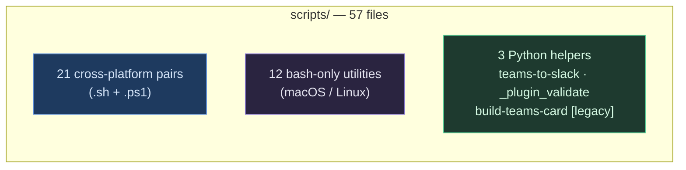

### Why two implementations per script?

The pipeline runs on whatever the operator has. macOS uses `launchd`, Windows uses Task Scheduler, both call into the same prompt and the same engine. For scripts the scheduler relies on (`notify-teams`, `notify-slack`, `publish-obsidian`), parity is non-negotiable — both `.sh` and `.ps1` must accept the same flags and produce the same artifacts. The Bash + PowerShell tests (`tests/test-notifications.sh` + `tests/test-all.ps1`) cross-verify this.

For operator-facing scripts (`health-check`, `log-summary`, `topic-edit`, etc.) we still maintain parity because Windows admins should not be second-class. The `Makefile` auto-detects the OS and routes to the correct extension, so `make health-check` always works.

For dev tooling that only makes sense on Unix (`shell-lint`, `launchctl` wrappers, `xdg-open`), we ship bash-only.

---

## 2. Script Categories

Scripts cluster into five categories. The first four contain cross-platform pairs; the fifth is bash-only.

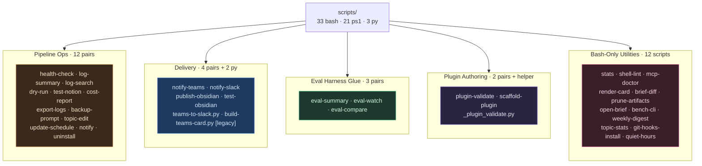

| Category | Purpose | Invoked by |
|---|---|---|
| **Pipeline Ops** | Daily operator chores: check health, summarize logs, dry-run prompts, edit topics, change schedule, send native notifications, uninstall | Operators (manual / `make`) |
| **Delivery** | Post the daily card to Teams + Slack, copy the Obsidian markdown to the vault | `briefing.sh` / `briefing.ps1` after a successful run |
| **Eval Harness Glue** | Inspect and compare eval results in `eval/store.sqlite` | Operators reviewing quality, CI in regression mode |
| **Plugin Authoring** | Lint plugin manifests, scaffold new Claude / Codex / Gemini plugins | Plugin developers, pre-commit hook |
| **Bash-Only Utilities** | Repo lint, project stats, MCP diagnostics, card rendering, artifact pruning, AI-CLI benchmarks, week-at-a-glance digest, topic frequency, launchd quiet hours, git hook installer | Developers, operators on Unix |

---

## 3. Cross-Platform Strategy

The `.sh` / `.ps1` pair is the foundational unit. Both halves accept the same flags, write to the same paths, and produce the same artifacts. The user never has to know which one they invoked.

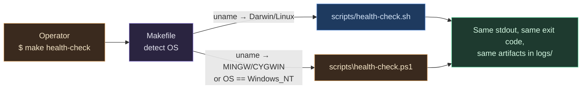

**How the Makefile decides:** `Makefile` runs `uname -s` once at the top and resolves a `PLATFORM` variable to `macos`, `linux`, or `windows`. Targets dispatch on that variable using `ifeq` blocks. The actual idiom (excerpted from `Makefile`):

```makefile
UNAME := $(shell uname -s 2>/dev/null || echo Windows)
ifeq ($(findstring MINGW,$(UNAME)),MINGW)
  PLATFORM := windows
else ifeq ($(findstring MSYS,$(UNAME)),MSYS)
  PLATFORM := windows
else ifeq ($(findstring CYGWIN,$(UNAME)),CYGWIN)
  PLATFORM := windows
else ifeq ($(UNAME),Darwin)
  PLATFORM := macos
else ifeq ($(UNAME),Windows)
  PLATFORM := windows
else
  PLATFORM := linux
endif

run: check ## Run the briefing now (foreground)
ifeq ($(PLATFORM),windows)
	@powershell -ExecutionPolicy Bypass -File "$(SCRIPT_DIR)/briefing.ps1" ...
else
	@bash "$(SCRIPT_DIR)/briefing.sh" ...
endif
```

**Parity is enforced by tests:** for every cross-platform pair, `tests/test-utility-scripts.sh` (on Unix) and `tests/test-all.ps1` (on Windows) verify:

- both files exist
- both use strict mode (`set -euo pipefail` / `$ErrorActionPreference = 'Stop'`)
- both accept the same flag set
- both produce JSON of the same shape under `--json`

If you change one half, you must change the other or the test fails.

---

## 4. Coding Conventions

Every shell script in this repo follows the same boilerplate. This is enforced by `shell-lint.sh` and (transitively) by `tests/test-bash-only-scripts.sh` + `tests/test-utility-scripts.sh`.

### 4.1 The Standard Header

```bash
#!/usr/bin/env bash
# scripts/<name>.sh — One-line synopsis (ends with period).
#
# Longer description of what the script does, what files it touches,
# and any environment variables it reads. Keep this to ~6 lines.
#
# Usage:
#   bash scripts/<name>.sh [--flag]    # what it does
#   bash scripts/<name>.sh --json      # machine-readable output

set -euo pipefail
```

### 4.2 Error Handling Rules

- **Always use `set -euo pipefail`.** `-e` aborts on uncaught failure, `-u` aborts on unset variables, `-o pipefail` propagates failures through pipes.
- **Wrap `grep` / `diff` / `find` in pipelines with `|| true`** when a non-match is expected — they exit 1 on no-match and `pipefail` will kill the script.
- **Use command-substitution capture with `|| true`** when you only want the value and absence is fine:
  ```bash
  engine="$(grep -Eo 'Engine: [a-z]+' "$log" | tail -1 | awk '{print $2}' || true)"
  ```
- **`printf '%s\n' "$marker"` over `printf "$marker"`** when the value can begin with `-` (e.g. dry-run markers like `---`). Otherwise printf will interpret the value as a flag.

### 4.3 Color Helpers

Every bash-only script defines the same six ANSI variables and auto-disables them when stdout is not a TTY (i.e. piped or redirected) and when JSON output was requested. The standard guard:

```bash
if [ -t 1 ] && [ "$JSON" -eq 0 ]; then
  R=$'\033[31m'; G=$'\033[32m'; Y=$'\033[33m'
  B=$'\033[1m';  D=$'\033[2m';  Z=$'\033[0m'
else
  R=''; G=''; Y=''; B=''; D=''; Z=''
fi
```

`render-card.sh` additionally accepts an explicit `--no-color` flag for users who want plain output even on a TTY. Other scripts can be forced to plain output by piping through `cat` (which makes `[ -t 1 ]` false).

### 4.4 Flag Conventions

| Flag | Meaning | Universal? |
|---|---|---|
| `--help` / `-h` | Print usage and exit 0 | **Yes** — every script |
| `--json` | Emit machine-readable JSON instead of human output | Where applicable |
| `--quiet` / `-q` | Suppress non-essential output | Where applicable |
| `--apply` | Toggle from dry-run to destructive | Only for destructive scripts (`prune-artifacts`) |
| `--strict` | Treat warnings as errors | Lint-style scripts |
| `--date YYYY-MM-DD` / `-d` | Operate on a specific day | Log-aware scripts |

### 4.5 Argument Parsing

We use a portable `while case` loop (not `getopt`, which differs between BSD and GNU):

```bash
while [ $# -gt 0 ]; do
  case "$1" in
    --json)         JSON=1; shift ;;
    --date)         DATE="$2"; shift 2 ;;
    -h|--help)      print_help; exit 0 ;;
    *)              echo "Unknown flag: $1" >&2; exit 2 ;;
  esac
done
```

### 4.6 Logging Verbs

- `→` for "starting an action"
- `✓` for success
- `✗` for failure
- `!` for warning
- `…` for in-progress

Used like: `printf '%s  %s\n' "${G}✓${Z}" "Notion config valid"`.

### 4.7 Idempotency

Every script must be safe to run twice. `prune-artifacts.sh` defaults to dry-run. `git-hooks-install.sh` refuses to overwrite without `--force`. `scaffold-plugin.sh` warns and exits when the target already exists. `quiet-hours.sh` no-ops when already paused.

---

## 5. Data Flow: How Scripts Interact With The Pipeline

The automated pipeline writes three artifact families to `logs/`. Operational scripts read those artifacts; delivery scripts publish them; dev tools lint and aggregate them.

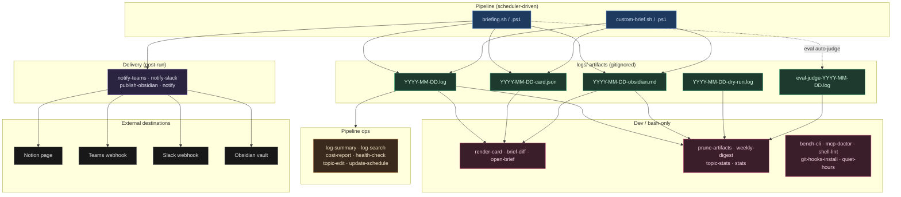

**Key invariants:**

- The scheduler only writes to `logs/`; it never touches the repo.
- Operational scripts are **read-only** against `logs/` (except for `prune-artifacts.sh` with `--apply`, and `export-logs.sh` which packages but does not delete).
- Delivery scripts read `*-card.json` / `*-obsidian.md` and POST or copy. They never modify the source artifact.
- Dev tools read the artifacts and may write back **only** under a new path (`bench-cli.sh` writes `logs/bench-<date>.json`, etc.).

---

## 6. Category Deep-Dive: Pipeline Ops

Twelve cross-platform pairs that operators run during the lifecycle of the briefing. None of these are invoked by the scheduler — they exist for humans.

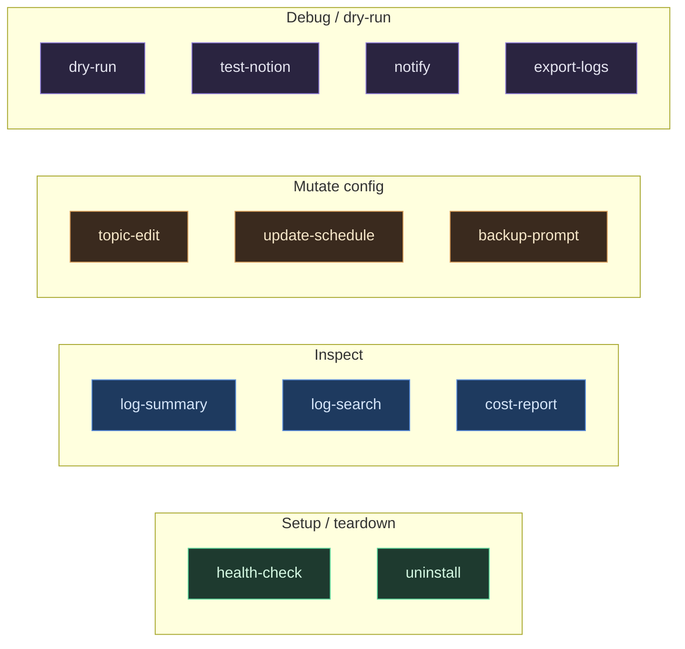

| Script | Purpose | Reads | Writes | Make Target |
|---|---|---|---|---|
| `health-check.sh` / `.ps1` | Verify Claude CLI, prompt structure, scheduler, logs dir, Notion config | All config files | nothing | — |
| `log-summary.sh` / `.ps1` | Show date / pass-fail / size / duration for the last N days | `logs/*.log` | nothing | — |
| `log-search.sh` / `.ps1` | grep-style search across all logs | `logs/*.log` | nothing | — |
| `dry-run.sh` / `.ps1` | Run Claude with a Notion-skip prompt | `prompt.md`, `dry-run-prompt.md` | `logs/YYYY-MM-DD-dry-run.log` | — |
| `test-notion.sh` / `.ps1` | Verify Notion MCP connectivity end-to-end | Notion MCP config | scratch Notion page (deleted) | — |
| `cost-report.sh` / `.ps1` | Parse token usage + cost markers from logs | `logs/*.log` | nothing (stdout table) | — |
| `export-logs.sh` / `.ps1` | Package logs into `tar.gz` / `zip` archive | `logs/*.log` | `logs-export-<ts>.tar.gz` | — |
| `backup-prompt.sh` / `.ps1` | Version `prompt.md` to `backups/` with timestamps | `prompt.md` | `backups/prompt-<ts>.md` | — |
| `topic-edit.sh` / `.ps1` | Add / remove / list topics in `prompt.md` | `prompt.md` | `prompt.md` (with backup) | — |
| `update-schedule.sh` / `.ps1` | Change daily run time + reload scheduler | `*.plist` / Task XML | `*.plist` + scheduler state | — |
| `notify.sh` / `.ps1` | Send native OS notification (success / failure / custom) | Today's log | nothing | — |
| `uninstall.sh` / `.ps1` | Remove scheduler + symlinks + (optionally) logs | scheduler state | removes installed files | `make uninstall` |

### Example interactions

Most pipeline-ops scripts are invoked directly because their use is interactive:

```bash
make install                            # depends on `make check`; installs scheduler
make uninstall                          # removes scheduler
bash scripts/health-check.sh            # full setup verification (run any time)
bash scripts/log-summary.sh 30          # last 30 days at a glance
bash scripts/log-search.sh "Anthropic"  # find every mention of Anthropic
bash scripts/dry-run.sh                 # exercise the prompt without Notion writes
bash scripts/topic-edit.sh add "OpenAI" # add a topic to prompt.md
bash scripts/update-schedule.sh 07 30   # move scheduler to 7:30 AM
bash scripts/notify.sh failure          # send a failure desktop notification
```

---

## 7. Category Deep-Dive: Delivery

Four cross-platform pairs (plus two Python helpers) that publish the daily card and the Obsidian markdown.

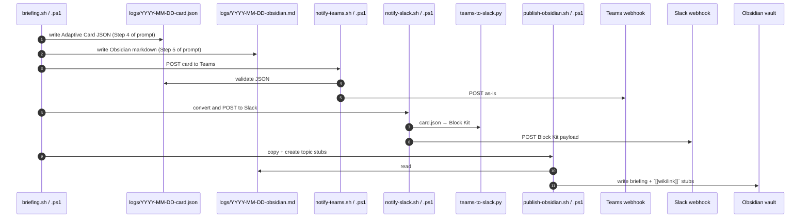

| Script | Reads | Writes | Network | Notes |
|---|---|---|---|---|
| `notify-teams.sh` / `.ps1` | `logs/*-card.json` | nothing | `AI_BRIEFING_TEAMS_WEBHOOK` | Supports `;`-separated multi-webhook |
| `notify-slack.sh` / `.ps1` | `logs/*-card.json` | nothing | `AI_BRIEFING_SLACK_WEBHOOK` | Shells out to `teams-to-slack.py` |
| `publish-obsidian.sh` / `.ps1` | `logs/*-obsidian.md` | Obsidian vault tree | none | Creates topic stubs for `[[wikilinks]]` |
| `test-obsidian.sh` / `.ps1` | Vault config | scratch file in vault | none | Verifies write permission |
| `teams-to-slack.py` | card.json (stdin / file) | Block Kit JSON (stdout) | none | Pure converter, callable standalone |
| `build-teams-card.py` | (none) | — | none | **Legacy.** Old log-parsing builder, no longer used. |

### Multi-webhook support

Both `notify-teams.sh` and `notify-slack.sh` accept semicolon-separated webhooks in their env var. By default only the first URL receives the card. Pass `--all` to fan-out.

```bash
export AI_BRIEFING_TEAMS_WEBHOOK="https://aaa;https://bbb;https://ccc"
bash scripts/notify-teams.sh           # posts to aaa only
bash scripts/notify-teams.sh --all     # posts to aaa, bbb, ccc
```

---

## 8. Category Deep-Dive: Eval Harness

Three cross-platform pairs that glue the CLI / Make experience to the Python harness in `eval/`. The harness itself (`eval/runner.py` + friends) does the heavy lifting; these wrappers exist so operators don't have to remember the Python flags.

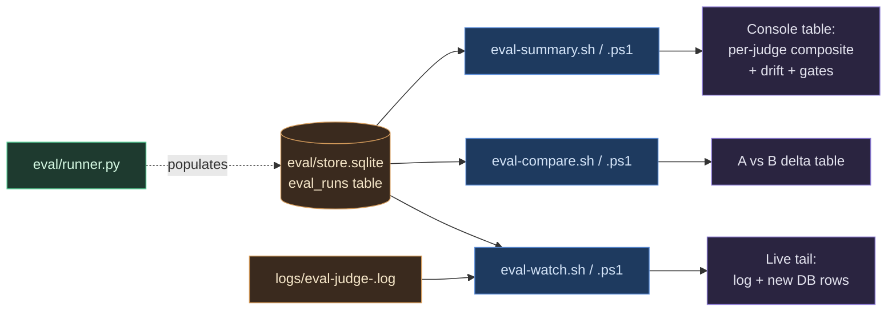

| Script | Purpose | Flags | Make Target |
|---|---|---|---|
| `eval-summary.sh` / `.ps1` | Per-judge median composite, drift status, gate fails, recent runs | `--judge <model>`, `--since YYYY-MM-DD`, `--until YYYY-MM-DD`, `--judges` | `make eval-summary` |
| `eval-watch.sh` / `.ps1` | Live-tail eval log + poll DB for new rows | `--date`, `--interval <s>`, `--no-db` | `make eval-watch` |
| `eval-compare.sh` / `.ps1` | Side-by-side comparison of two judges (or two prompt versions) | `--a <judge>`, `--b <judge>`, `--threshold 0.5`, `--a-prompt`, `--b-prompt` | `make eval-compare` |

### When to use each

- **`eval-summary`** — Daily / weekly sanity check. "How is the briefing doing?"
- **`eval-watch`** — During a `make eval-backfill` so you can see scores stream in.
- **`eval-compare`** — Before rebaselining (`make eval-seed-golden`). Run the current judge against a candidate new judge and confirm the delta is within tolerance.

---

## 9. Category Deep-Dive: Plugin Authoring

Two cross-platform pairs plus a Python helper that keep the Claude / Codex / Gemini plugin ecosystem honest.

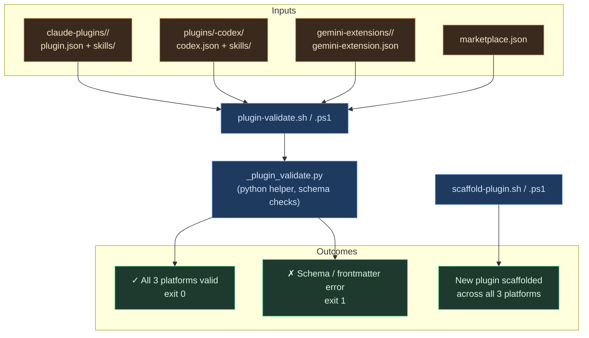

### `plugin-validate.sh` / `.ps1`

Validates every plugin manifest, marketplace entry, SKILL.md frontmatter, and agent file across all three platforms. Non-zero exit on any error. Warnings are informational unless `--strict` is passed.

Internally calls `_plugin_validate.py` which carries the schema rules so we can validate JSON, TOML, and YAML frontmatter in one place.

```bash
bash scripts/plugin-validate.sh              # validate everything
bash scripts/plugin-validate.sh --strict     # warnings become errors
bash scripts/plugin-validate.sh --json       # CI-friendly JSON
```

### `scaffold-plugin.sh` / `.ps1`

Bootstraps a new plugin across all three platforms in one shot.

```bash
bash scripts/scaffold-plugin.sh --name digest --description "Daily summarizer"
bash scripts/scaffold-plugin.sh --name digest --description "..." --skill default-skill
bash scripts/scaffold-plugin.sh --name digest --description "..." --with-agent reviewer
```

Generates:

- `claude-plugins/digest/plugin.json` + `skills/default-skill/SKILL.md`
- `plugins/digest-codex/codex.json` + `skills/default-skill/SKILL.md`
- `gemini-extensions/digest/gemini-extension.json` + `GEMINI.md`
- Marketplace snippet printed to stdout for manual paste into `marketplace.json`

### Pre-commit integration

`git-hooks-install.sh` wires `plugin-validate.sh` into a pre-commit hook so any commit touching plugin files is automatically validated before commit. See [Section 10.10](#1010-git-hooks-installsh).

---

## 10. Category Deep-Dive: Bash-Only Utilities

The 12 bash-only utilities are the dev-experience layer of the project. Each one solves a real problem we encountered while operating the pipeline. All follow the conventions in [Section 4](#4-coding-conventions).

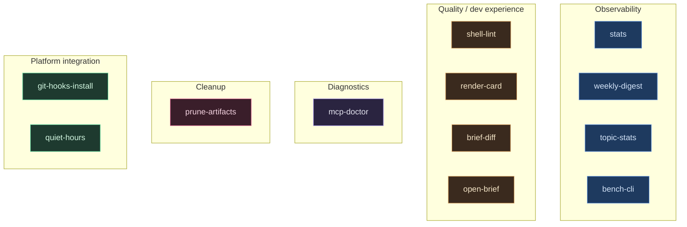

### 10.1 `stats.sh`

Project state overview: lines of code, file counts by type, plugin counts, eval row count, log count.

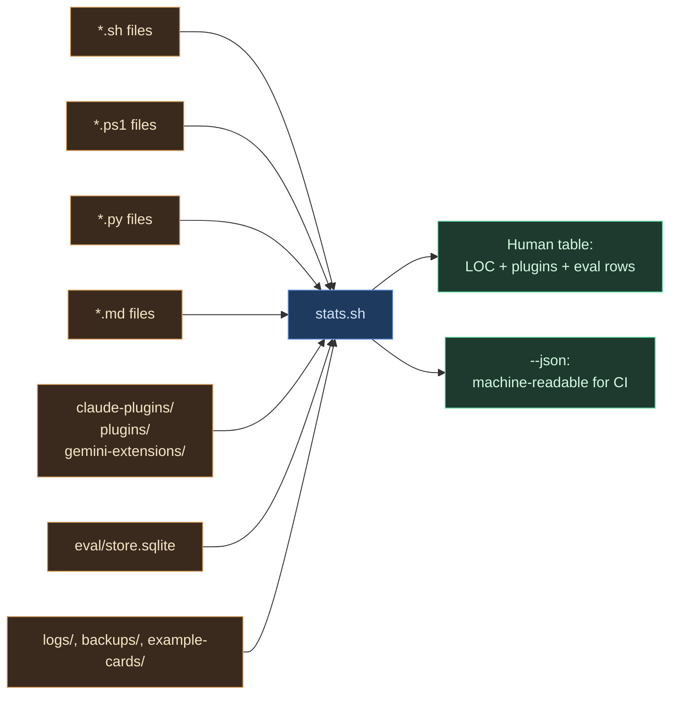

```bash
bash scripts/stats.sh             # human-readable table
bash scripts/stats.sh --json      # CI / dashboard payload
make stats                        # equivalent
make stats JSON=1                 # JSON output via make
```

### 10.2 `shell-lint.sh`

`bash -n` + `shellcheck` wrapper for every `.sh` in the repo. Skips `.git/`, `node_modules/`, and `vendor/`. Exits non-zero on any syntax error; warnings only fail in `--strict`.

```bash
bash scripts/shell-lint.sh                 # everything
bash scripts/shell-lint.sh --no-shellcheck # syntax only
bash scripts/shell-lint.sh --strict        # warnings → errors
bash scripts/shell-lint.sh --path scripts/ # subset
make shell-lint
make shell-lint STRICT=1
```

This is the script you run before pushing. It's also wired into `git-hooks-install.sh` so every commit is linted automatically.

### 10.3 `mcp-doctor.sh`

Diagnoses MCP server configuration across the supported CLIs. Inspects each CLI's config file (Claude / Codex / Gemini / Copilot), validates JSON/TOML where applicable, and reports whether a named MCP server (default `notion`) is configured.

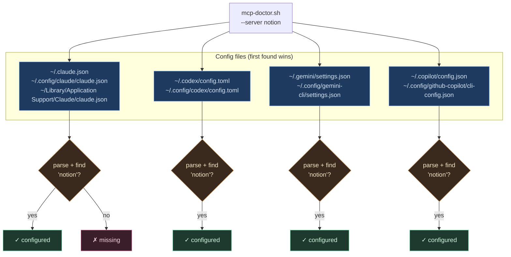

```bash
bash scripts/mcp-doctor.sh                 # all CLIs we can find
bash scripts/mcp-doctor.sh --server notion # focus on notion (default)
bash scripts/mcp-doctor.sh --cli claude    # one CLI
bash scripts/mcp-doctor.sh --json          # machine-readable
make mcp-doctor
make mcp-doctor SERVER=memory CLI=claude
```

### 10.4 `render-card.sh`

Pretty-prints a daily `*-card.json` in the terminal with ANSI colors. Walks the Adaptive Card body: emphasis containers become section headers, inline `**Bold**` TextBlocks become topic sub-headers, leading `- ` bullets stay as bullets, and the `Action.OpenUrl` is shown as a "View" hint at the end.

```bash
bash scripts/render-card.sh                       # today's card
bash scripts/render-card.sh --date 2026-03-18     # specific date
bash scripts/render-card.sh --file path/to.json   # any file
bash scripts/render-card.sh --example 2026-03-18  # from example-cards/
bash scripts/render-card.sh --no-color            # piping-friendly
make render-card D=2026-03-18
make render-card EXAMPLE=1 D=2026-03-18
```

### 10.5 `brief-diff.sh`

Shows what changed between two days of briefings. Extracts topic headers + bullets from each `*-card.json` into a flat text form, then runs `diff -u` (or `delta` / `colordiff` if installed). Defaults to yesterday vs today.

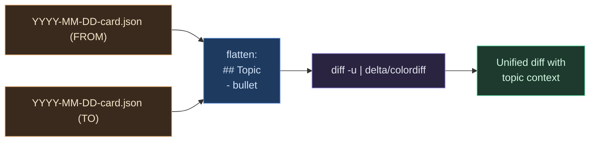

```bash
bash scripts/brief-diff.sh                                   # yesterday vs today
bash scripts/brief-diff.sh --from 2026-03-17 --to 2026-03-18
bash scripts/brief-diff.sh --example --from 2026-03-17 --to 2026-03-18
bash scripts/brief-diff.sh --plain                           # no color
make brief-diff FROM=2026-03-17 TO=2026-03-18
```

### 10.6 `prune-artifacts.sh`

Cleans up orphaned briefing artifacts in `logs/`. An artifact is **orphaned** when the corresponding date's `.log` file is missing.

Scans four artifact families:

- `YYYY-MM-DD-card.json` — Adaptive Card payloads
- `YYYY-MM-DD-obsidian.md` — Obsidian publish source
- `YYYY-MM-DD-dry-run.log` — dry-run output
- `eval-judge-YYYY-MM-DD.log` — eval auto-judge logs (only with `--include eval`)

**Defaults to dry-run.** Pass `--apply` to actually delete.

```bash
bash scripts/prune-artifacts.sh                      # dry-run, list orphans
bash scripts/prune-artifacts.sh --apply              # actually delete
bash scripts/prune-artifacts.sh --days 30 --apply    # only > 30 days old
bash scripts/prune-artifacts.sh --include eval       # also prune eval logs
bash scripts/prune-artifacts.sh --json               # machine-readable
make prune-artifacts                                 # dry-run via make
make prune-artifacts APPLY=1 DAYS=30
```

### 10.7 `open-brief.sh`

Opens today's (or a specified date's) briefing artifacts in the system's default application. Uses `open` on macOS, `xdg-open` on Linux, and falls back to printing the path if neither is available.

| `--what` | Opens |
|---|---|
| `log` (default) | `logs/YYYY-MM-DD.log` |
| `card` | `logs/YYYY-MM-DD-card.json` |
| `obsidian` | `logs/YYYY-MM-DD-obsidian.md` |
| `notion` | Extracts the Notion URL from the card's `Action.OpenUrl` and opens it |
| `dir` | The `logs/` directory itself |
| `all` | All of the above (one window per artifact) |

```bash
bash scripts/open-brief.sh                          # today's log
bash scripts/open-brief.sh --what card
bash scripts/open-brief.sh --date 2026-03-18 --what notion
bash scripts/open-brief.sh --what dir
make open-brief WHAT=card D=2026-03-18
make open-brief WHAT=notion
```

### 10.8 `bench-cli.sh`

Tiny benchmark of each installed AI CLI. Sends a one-line prompt to each engine in turn, measuring wall-clock time and capturing whether it responded with non-empty output before a timeout. Useful for picking the snappiest engine on the current network.

```bash
bash scripts/bench-cli.sh                 # all installed engines
bash scripts/bench-cli.sh --timeout 45    # per-engine timeout (default 30s)
bash scripts/bench-cli.sh --only claude,gemini
make bench-cli
make bench-cli ONLY=copilot TIMEOUT=5
```

Output is a single table with columns: `engine`, `status` (one of ok / timeout / fail), `wall (ms)`, `bytes`, and a short response `preview`.

### 10.9 `weekly-digest.sh`

Multi-day digest of briefing activity. Aggregates the last N days of logs, card.json files, and (if available) eval store rows into a single console summary: success rate, engine breakdown, top source domains, estimated cost, and median composite score.

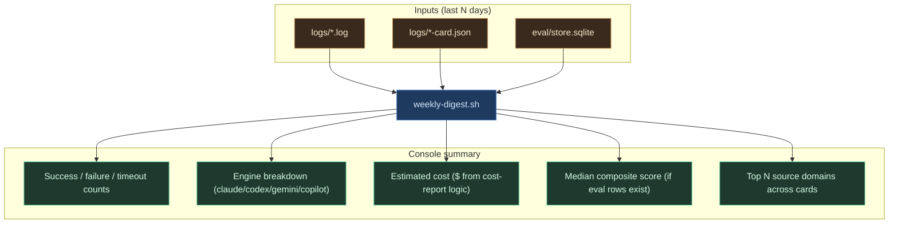

```bash
bash scripts/weekly-digest.sh                # last 7 days
bash scripts/weekly-digest.sh --days 14
bash scripts/weekly-digest.sh --since 2026-03-01 --until 2026-03-18
bash scripts/weekly-digest.sh --top 5        # top N source domains
make weekly-digest
make weekly-digest DAYS=14 TOP=5
```

### 10.10 `topic-stats.sh`

Tallies `[[wikilink]]` topic mentions across published briefings. Scans `logs/*-obsidian.md` by default. Pass `--vault` to also include files in the configured Obsidian vault (`AI_BRIEFING_OBSIDIAN_VAULT`).

```bash
bash scripts/topic-stats.sh                       # default top 20 from logs/
bash scripts/topic-stats.sh --top 50
bash scripts/topic-stats.sh --since 2026-03-01
bash scripts/topic-stats.sh --vault               # also scan vault
bash scripts/topic-stats.sh --vault-only          # only scan the vault
make topic-stats
make topic-stats TOP=50 VAULT=1
```

Use this to track topic drift over time. If "Anthropic" appears 28 times this month and "OpenAI" only 4, the prompt may be biased toward Anthropic — and that's exactly the sort of editorial signal `topic-edit.sh` is for.

### 10.11 `git-hooks-install.sh`

Installs a pre-commit hook that runs three checks on every commit:

1. `bash -n` on every staged `*.sh` file
2. `scripts/plugin-validate.sh` if any plugin file is staged
3. `bash tests/test-portability.sh` (the fast, no-external-calls suite)

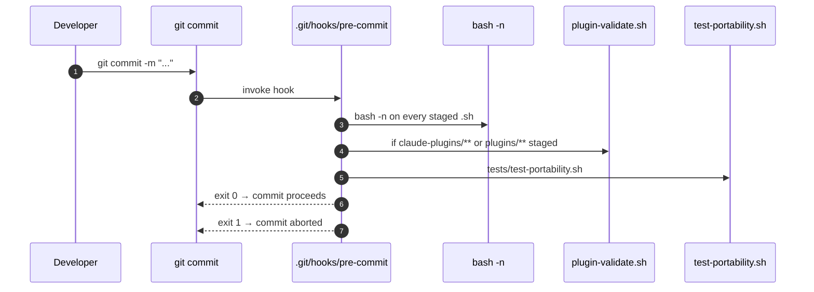

```bash
bash scripts/git-hooks-install.sh             # install (refuses to overwrite)
bash scripts/git-hooks-install.sh --force     # overwrite existing hook
bash scripts/git-hooks-install.sh --uninstall # remove the hook
make git-hooks-install
make git-hooks-install UNINSTALL=1
```

### 10.12 `quiet-hours.sh`

Pauses or resumes the macOS `launchd` job for the daily briefing. A macOS-only convenience wrapper around `launchctl` that records a small state file so subsequent runs can see whether the agent is paused. On Linux/Windows this is a no-op with a hint.

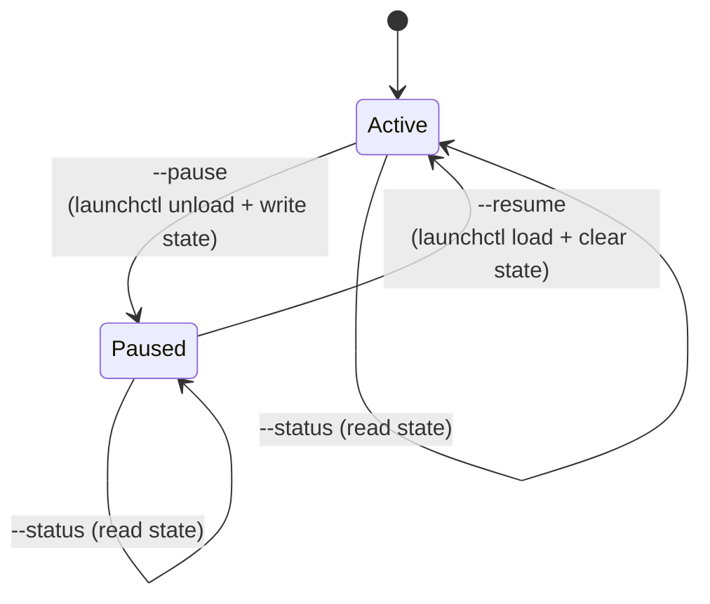

```bash
bash scripts/quiet-hours.sh                  # show status
bash scripts/quiet-hours.sh --pause          # unload the plist
bash scripts/quiet-hours.sh --resume         # reload the plist
bash scripts/quiet-hours.sh --status         # explicit status
bash scripts/quiet-hours.sh --json           # machine-readable
make quiet-hours                             # status
make quiet-hours PAUSE=1
make quiet-hours RESUME=1
```

Perfect for vacations and conferences: pause before you leave, resume when you're back. The state file lives at `<repo>/logs/.quiet-state` (a tiny `paused_at=<UTC timestamp>` line) so subsequent invocations can detect whether the agent is currently paused.

---

## 11. Make Target Index

Every script has a corresponding Make target (where the user-facing surface justifies it). The Makefile dispatches on OS so the same target works on macOS, Linux, and Windows.


### Pipeline targets

| Target | What it does |
|---|---|
| `make help` | Show every target with one-line help |
| `make info` | Project configuration summary |
| `make check` | Verify at least one supported AI CLI is installed |
| `make install` | Install the platform scheduler (daily 8:00 AM) |
| `make uninstall` | Remove the platform scheduler |
| `make status` | Show scheduler status |
| `make validate` | Validate all project files exist and are well-formed |
| `make run` | Run the briefing now (foreground). Options: `D=2026-03-15 CLI=codex` |
| `make run-bg` | Run the briefing in background. Options: `D=...` `CLI=...` |
| `make run-scheduled` | Trigger the scheduled task via OS scheduler |
| `make custom-brief` | Deep-research a topic. `T="topic" CLI=codex NOTION=1 OBSIDIAN=1 TEAMS=1 SLACK=1` |
| `make custom-brief-bg` | Deep-research in background |

### Logs targets

| Target | What it does |
|---|---|
| `make log` | Print today's log |
| `make log-date` | Print log for `D=YYYY-MM-DD` |
| `make logs` | List all log files with sizes |
| `make tail` | Tail today's log (live) |
| `make clean-logs` | Delete logs older than 30 days |
| `make purge-logs` | Delete ALL logs |
| `make prompt` | Print the current prompt |

### Eval targets

| Target | What it does |
|---|---|
| `make eval` | Score today's card. `D=YYYY-MM-DD JUDGE=stub\|claude\|codex\|gemini GATE=1` |
| `make eval-backfill` | Score every card in `example-cards/`. `JUDGE=stub` by default |
| `make eval-drift` | Drift check. `D=YYYY-MM-DD ALERT_EXIT=1` |
| `make eval-regression` | Re-score golden cards, fail if composite drops > 0.5 |
| `make eval-show` | Dump stored eval rows |
| `make eval-report` | Weekly Markdown report. `D=YYYY-MM-DD W=7 OUT=path` |
| `make eval-seed-golden` | Seed `eval/golden/` from store.sqlite. `JUDGE=<model> CLEAN=1` |
| `make eval-test` | Run unit tests for the eval harness |
| `make eval-dashboard` | Build interactive dashboard. `DASHBOARD_JUDGE=<model> OPEN=1` |
| `make eval-summary` | At-a-glance summary. `JUDGE=<model> SINCE=... UNTIL=...` |
| `make eval-watch` | Live-tail eval-judge logs + new DB rows. `D=... INTERVAL=2` |
| `make eval-compare` | Compare two judges. `A=<judge> B=<judge> THRESHOLD=0.5` |

### Plugin authoring targets

| Target | What it does |
|---|---|
| `make plugin-validate` | Lint every plugin manifest, marketplace entry, skill, and agent. `STRICT=1 JSON=1` |
| `make scaffold-plugin` | Bootstrap a new plugin across all 3 platforms. `NAME=<name> DESC="..."` |

### Bash-only utility targets

| Target | What it does |
|---|---|
| `make stats` | Project state overview. `JSON=1` for machine-readable |
| `make shell-lint` | Lint every `.sh` in the repo. `STRICT=1` fails on warnings |
| `make mcp-doctor` | Diagnose MCP server configs. `SERVER=notion CLI=claude JSON=1` |
| `make render-card` | Pretty-print a card.json in the terminal. `D=YYYY-MM-DD EXAMPLE=1` |
| `make brief-diff` | Diff two days of briefings. `FROM=YYYY-MM-DD TO=YYYY-MM-DD EXAMPLE=1` |
| `make prune-artifacts` | Find/remove orphaned card.json + obsidian.md. `APPLY=1 DAYS=N` |
| `make open-brief` | Open today's brief artifacts. `WHAT=log\|card\|obsidian\|notion\|dir\|all D=...` |
| `make bench-cli` | Benchmark installed AI CLIs. `TIMEOUT=30 ONLY=claude,gemini` |
| `make weekly-digest` | Multi-day digest. `DAYS=7 TOP=10 SINCE=... UNTIL=...` |
| `make topic-stats` | Tally wikilink topics. `TOP=20 VAULT=1` |
| `make git-hooks-install` | Install pre-commit hook. `FORCE=1 UNINSTALL=1` |
| `make quiet-hours` | Pause/resume the launchd briefing job (macOS). `PAUSE=1 \| RESUME=1` |

---

## 12. Testing Strategy

Every script in this directory has automated test coverage. The split is:

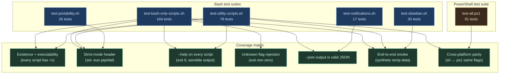

**Coverage policy:**

- Every script in `scripts/` is exercised by at least one test.
- Every script has a `--help` test (or for unscripted operator tools like `health-check`, a "runs cleanly" test).
- Every cross-platform pair has a parity test.
- Every script that touches `logs/` is tested against a synthetic temp directory so the suite is hermetic.
- No test calls Claude, Notion, Teams, Slack, or any other external service.

**Run the full battery:**

```bash
bash tests/run-all.sh                          # 460 bash tests
powershell -F tests/test-all.ps1               # 91 PowerShell tests
python -m unittest discover -s eval/tests      # eval harness (10 tests)
```

**Run a single script's tests:**

```bash
bash tests/test-bash-only-scripts.sh
bash tests/test-utility-scripts.sh
```

---

## 13. Adding A New Script

Use this checklist whenever you add a new script. The tests will fail until every step is done.

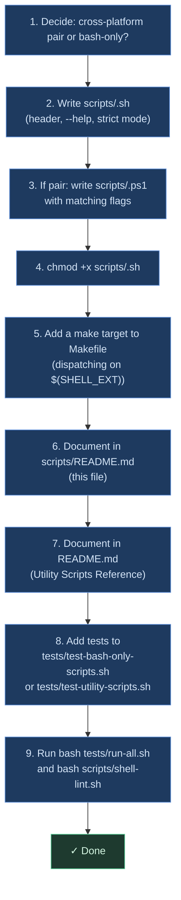

### Skeleton

```bash
#!/usr/bin/env bash
# scripts/<name>.sh — One-line synopsis.
#
# Longer description.
#
# Usage:
#   bash scripts/<name>.sh [--flag]

set -euo pipefail

# Colors (auto-disable when piped)
if [ -t 1 ] && [ -z "${NO_COLOR:-}" ]; then
  R=$'\033[31m'; G=$'\033[32m'; Y=$'\033[33m'
  B=$'\033[1m';  D=$'\033[2m';  Z=$'\033[0m'
else
  R=''; G=''; Y=''; B=''; D=''; Z=''
fi

print_help() {
  cat <<'EOF'
<name>.sh — One-line synopsis.

Usage:
  bash scripts/<name>.sh                # default behavior
  bash scripts/<name>.sh --json         # machine-readable

Flags:
  --json     Emit JSON
  -h, --help Show this message
EOF
}

JSON=0
while [ $# -gt 0 ]; do
  case "$1" in
    --json)    JSON=1; shift ;;
    -h|--help) print_help; exit 0 ;;
    *)         printf '%sUnknown flag: %s%s\n' "$R" "$1" "$Z" >&2; exit 2 ;;
  esac
done

# ... your logic here ...
```

### Make target snippet

```makefile
.PHONY: my-new-target
my-new-target: ## One-line help for `make help`
	@$(RUNNER) scripts/my-new-script.$(SHELL_EXT) $(if $(JSON),--json)
```

### Test snippet

Add to `tests/test-bash-only-scripts.sh`:

```bash
section "my-new-script.sh"
expect_exists "$ROOT/scripts/my-new-script.sh"
expect_executable "$ROOT/scripts/my-new-script.sh"
expect_syntax_ok "$ROOT/scripts/my-new-script.sh"
expect_help_works "$ROOT/scripts/my-new-script.sh"
expect_unknown_flag_rejected "$ROOT/scripts/my-new-script.sh"
```

---

## 14. Environment Variable Reference

Scripts read configuration from environment variables. None are required at run-time — every script falls back to sane defaults — but several unlock optional behavior.

| Variable | Read by | Default | Purpose |
|---|---|---|---|
| `AI_BRIEFING_CLI` | `briefing.sh`, `custom-brief.sh` | auto-detect via fallback chain | Force a specific engine (`claude` / `codex` / `gemini` / `copilot`) |
| `AI_BRIEFING_MODEL` | `briefing.sh`, `custom-brief.sh` | engine-specific | Override the model passed to the selected engine |
| `AI_BRIEFING_TZ` | `briefing.sh` / `.ps1` | `America/Los_Angeles` (`Pacific Standard Time` on Windows) | Timezone for the briefing's "today" and the 08:00 schedule. DST handled automatically. *nix uses IANA ids; Windows uses Windows zone ids (PS 7+ also accepts IANA). |
| `AI_BRIEFING_TEAMS_WEBHOOK` | `notify-teams.sh` / `.ps1` | unset | Teams Incoming Webhook URL (or `;`-separated list) |
| `AI_BRIEFING_SLACK_WEBHOOK` | `notify-slack.sh` / `.ps1` | unset | Slack Incoming Webhook URL (or `;`-separated list) |
| `AI_BRIEFING_OBSIDIAN_VAULT` | `briefing.sh`, `publish-obsidian.sh` / `.ps1`, `test-obsidian.sh` / `.ps1`, `topic-stats.sh` | unset | Absolute path to the Obsidian vault root. When unset, Obsidian publishing is skipped. |

For eval glue scripts, the judge model is supplied via the `--judge` flag (or the first `claude*` / `gemini*` / `codex*` row in the store, falling back to the most-frequent judge). There is no `EVAL_JUDGE_MODEL` env var.

For ANSI color control, every bash-only script auto-disables colors when stdout is not a TTY or when `--json` is set. `render-card.sh` additionally honors a `--no-color` flag.

---

## 15. Exit Code Conventions

```
0   success
1   expected failure (e.g. lint found warnings, file not found)
2   bad arguments (unknown flag, missing required value)
3   environment problem (binary missing, env var unset, OS unsupported)
```

Scripts that wrap external tools propagate the inner tool's exit code where it makes sense. `plugin-validate.sh` exits 1 on any schema violation, 0 otherwise. `shell-lint.sh` exits 0 even with shellcheck warnings unless `--strict` is set; syntax errors always exit 1.

---

## See Also

- [`../README.md`](../README.md) — User-facing project documentation
- [`../ARCHITECTURE.md`](../ARCHITECTURE.md) — System architecture (mermaid-heavy)
- [`../E2E_FLOW.md`](../E2E_FLOW.md) — End-to-end pipeline walkthrough
- [`../TESTS.md`](../TESTS.md) — Test suite documentation
- [`../LOGS.md`](../LOGS.md) — Log tailing and management
- [`../PLUGINS.md`](../PLUGINS.md) — Plugin ecosystem documentation
- [`../eval/README.md`](../eval/README.md) — Eval harness documentation
